In this post we will look at how we can utilize an existing AnyConnect deployment to automatically install AMP for Endpoints when connecting to an AnyConnect server (ASA / FTD).

## Why should I use AnyConnect for installing AMP for Endpoints?

As you may know you can install AMP for Endpoints by downloading a prepackaged installer from the AMP console and manually running the .exe. You may also use that installer to build your own MSI or utilize a GroupPolicy within your Windows domain to automatically install AMP for Endpoints without any wizard interaction. For larger deployments utilizing existing, dedicated deployment tools makes sense, but if that is no option for you using the familiar AnyConnect approach might be the better fit to automatically rollout the AMP for Endpoints client to all your managed Windows and MacOS devices.

## Requirements – what do I need?

Before you continue please make sure you have the following components in place

- A https webserver that can host the AMP for Endpoints installer files (with a valid (!) certificate)
- A windows workstation with AnyConnect Profile Editor installed
- An existing AnyConnect setup with ASA or FTD managed by FMC

## How does this AnyConnect driven AMP Rollout work exactly?

AnyConnect provides a module called AMP Enabler. When a user connects to a AnyConnect server (ASA/FTD) the client is being instructed to download and install the AMP Enabler module and configuration profile. After the AnyConnect connection is up, the module reads tries to reach out to the server specified in the profile that hosts an actual installation file of Amp for Endpoints. It downloads the AMP Connector setup and automatically executes the setup.

TL ; DR – User connects via AnyConnect – AMP Enabler downloads installer from internal webserver and silently installs AMP connector on the endpoints.

Now that we know how the process works let’s look at the exact steps that we need to perform to rollout AMP for Endpoints via AnyConnect.

## Setting up AMP Enabler

### \#1 Download AMP for Endpoints Installer

Navigate to your AMP for Endpoints console and login

- EU Cloud (<https://auth.eu.amp.cisco.com/>)
- US Cloud (<https://auth.amp.cisco.com/>)

Navigate to **Management \> Download Connector**

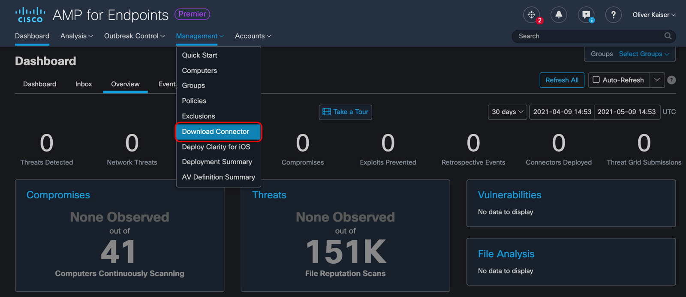

Select the group (and hence policy) that will be automatically assigned to your new clients and download the Connector setup for Windows and MacOS:

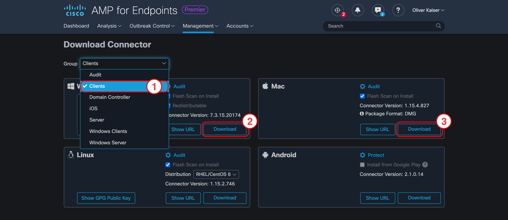 
Policies are always mapped to a group of computers in AMP for Endpoints. After installing the connector your new clients will be automatically added to the group you have chosen during in the **Download Connector** section


Before proceeding to the next step you need to place the installer files on a webserver that will be reachable to your clients once they connect to the internal network with AnyConnect.

For testing I use a python script to start a https webserver. If you only want to test this setup in your lab I would recommend using it, that way you do not have to setup or configure an apache2 / ngninx / IIS server for hosting the installer files.

<details>
<summary>Python3 Webserver</summary>

``` python
import http.server, ssl

server_address = ('0.0.0.0', 443)
httpd = http.server.HTTPServer(server_address, http.server.SimpleHTTPRequestHandler)
httpd.socket = ssl.wrap_socket(httpd.socket,
                                server_side=True,
                                certfile='/root/lab/pubkey.pem',
                                keyfile='/root/lab/privkey.pem',
                                ssl_version=ssl.PROTOCOL_TLS)
httpd.serve_forever()
```


The script **requires a public and private key**. In my lab I have used openssl to generate a CSR which I then signed with my lab certificate authority. Depending on your OS you might have to execute the script as **superuser** to bind to **0.0.0.0:443**


</details>

### \#2 Create a profile for AMP Enabler

To generate the xml profile we will use the standalone AnyConnect Profile Editor. Just add the FQDN to your internal webserver that will host the installer files and save the profile.


**Tip**

You find the AnyConnect Profile Editor at <a href="https://software.cisco.com/download/home/286281283/type" rel="noreferrer noopener" target="_blank">software.cisco.com</a>. Before installing the AnyConnect Profile Editor make sure you have a [Java RunTime](https://www.java.com/en/download/manual.jsp) on your system
 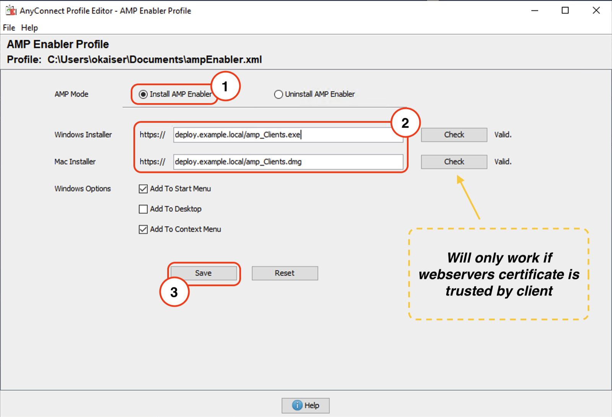 
**Warning**

The **Check** in the profile editor triggers a https request to the webserver hosting the installer. If your client cannot reach said webserver or the tls certificate is not trusted by your local Java keystore the check will fail.

For the check to work correctly you can import your internal CA certificate into your java keystore with the following command using powershell (as Administrator (!)):


``` powershell
# Make sure to change the path to your Java installation path. In this example I am using JRE 1.8.0-291
# This is only neccessary if your webserver does uses a certificate that is not trusted by Java (e.g. Enterprise PKI)
cd 'C:\Program Files (x86)\Java\jre1.8.0_291\bin'
.\keytool.exe -import -keystore 'C:\Program Files (x86)\Java\jre1.8.0_291\lib\security\cacerts' -storepass changeit -trustcacerts -alias example-ca -file 'C:\Users\okaiser\Desktop\root-ca.pem'
```

If you do not want to use AnyConnect profile editor you can manually edit the following xml that was generated by Profile Editor (configuration valid as of Firepower 6.7.0 / ASA 9.15)

<details>
<summary>AMPEnabler Profile</summary>

``` xml
<?xml version="1.0" encoding="UTF-8"?>
<FAProfile xsi:noNamespaceSchemaLocation="FAProfile.xsd" xmlns:xsi="http://www.w3.org/2001/XMLSchema-instance">
<FAConfiguration>
  <Install>
  <WindowsConnectorLocation>https://deploy.example.local/amp_Clients.exe</WindowsConnectorLocation>
  <MacConnectorLocation>https://deploy.example.local/amp_Clients.dmg</MacConnectorLocation>
  <StartMenu>false</StartMenu>
  <DesktopIcon>false</DesktopIcon>
  <ContextIcon>false</ContextIcon>
  </Install>
  </FAConfiguration>
</FAProfile>
```

</details>

### \#3 Upload AMP Enabler profile

<details open>
<summary>ASA</summary>

Copy profile file to ASA using SCP

``` bash
> scp ampenabler.xml asa01.example.com:/ampenabler.xml
```


**Warning**

Profiles are not automatically replicated to the standby unit in an active/standby failover unit. Always copy your profiles to both firewalls!


Verify that the profile was successfully uploaded to ASA and verify its contents

    asa# dir disk0: 

    Directory of disk0:/
    (...)
    127    -rwx  530          20:15:05 May 09 2021  ampenabler.xml
    (...)

    asa# more disk0:/ampenabler.xml

    <?xml version="1.0" encoding="UTF-8"?>
    <FAProfile xsi:noNamespaceSchemaLocation="FAProfile.xsd" xmlns:xsi="http://www.w3.org/2001/XMLSchema-instance">
    <FAConfiguration>
      <Install>
     <WindowsConnectorLocation>https://deploy.example.local/amp_Clients.exe</WindowsConnectorLocation>
      <MacConnectorLocation>https://deploy.example.local/amp_Clients.dmg</MacConnectorLocation>
      <StartMenu>false</StartMenu>
      <DesktopIcon>false</DesktopIcon>
      <ContextIcon>false</ContextIcon>
      </Install>
      </FAConfiguration>
    </FAProfile>

</details>

<details>
<summary>FMC</summary>

Navigate to **Objects \> VPN \> AnyConnect File** and upload the ampenabler profile

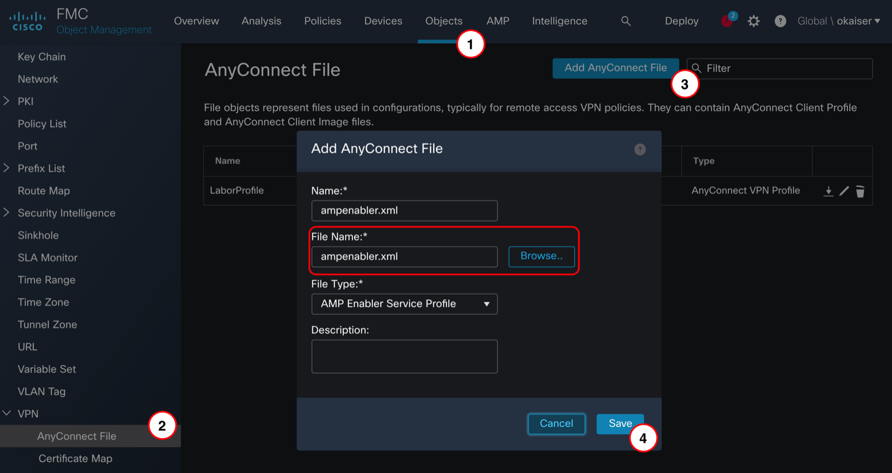 
FMC 6.7.0 introduced native management of AnyConnect modules, older software releases require FlexConfig. I advise against using FlexConfig, but if you want to go down that road here is a guide to get you started:\
\
[Advanced AnyConnect VPN Deployments for Firepower Threat Defense with FTD](https://www.cisco.com/c/en/us/td/docs/security/firepower/config_examples/advanced-anyconnect-ftd-fmc/advanced-anyconnect-vpn-ftd-fmc.html)


</details>

### \#4 Enable AMP Enabler module

To utilize the **ampenabler** module we need to configure a new AnyConnect profile and reference both the module and profile in our existing **GroupPolicy** configuration

<details open>
<summary>ASA</summary>

Create new AnyConnect profile and link it to the uploaded xml file from step \#3

    asa# configure terminal
    asa(config)# webvpn
    asa(config-webvpn)# anyconnect profiles amp disk0:/ampenabler.xml

Reference profile and module in existing GroupPolicy

    asa(config)#  group-policy GroupPolicy_AnyConnect attributes
    asa(config-group-policy)# webvpn
    asa(config-group-webvpn)# anyconnect modules value ampenabler
    asa(config-group-webvpn)# anyconnect profiles value amp type ampenabler

Save configuration

    asa# copy running-config startup-config

</details>

<details>
<summary>FMC</summary>

Navigate to **Objects \> VPN \> Group Policy** and **open** your existing GroupPolicy

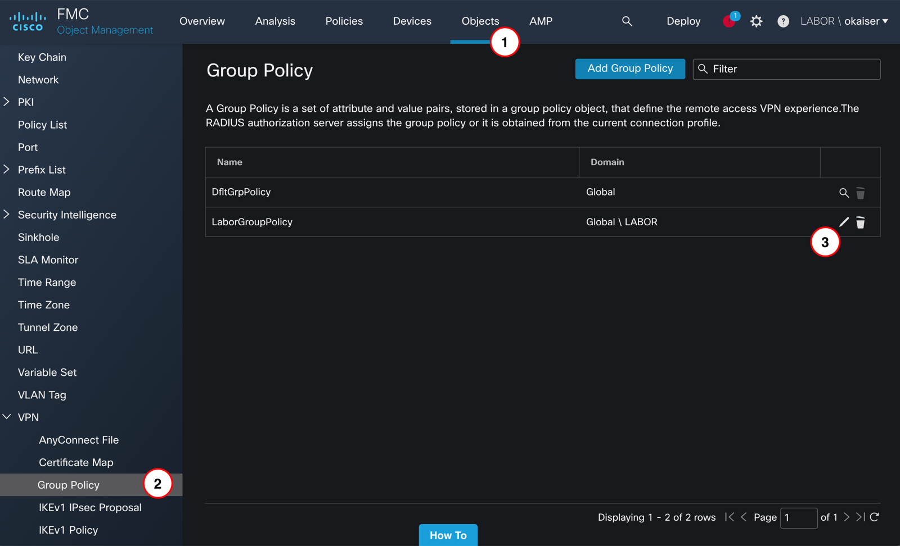

Navigate to **AnyConnect \> Client Modules** and **add** a new module

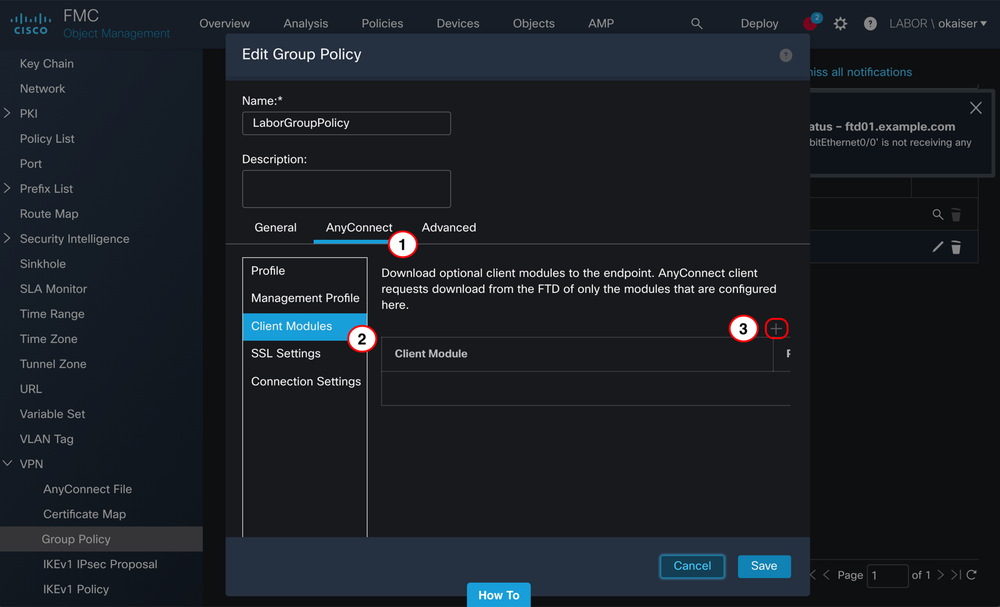

Select *“AMP Enabler”* for **Client Module**, *“ampenabler.xml”* for **Profile to download** and save both the Client Module and GroupPolicy configuration

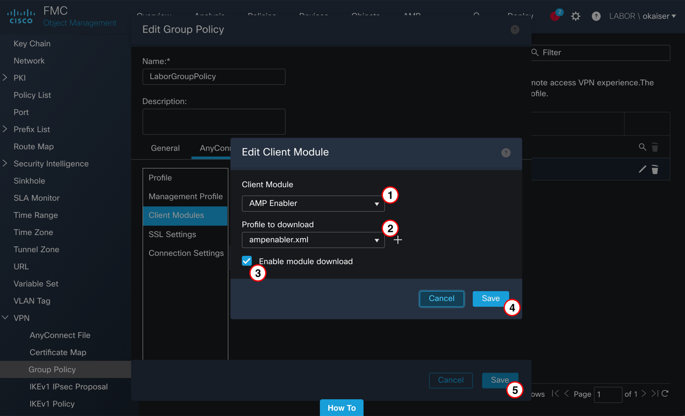

Verify configuration before deployment (**Deploy \> Deployment**)

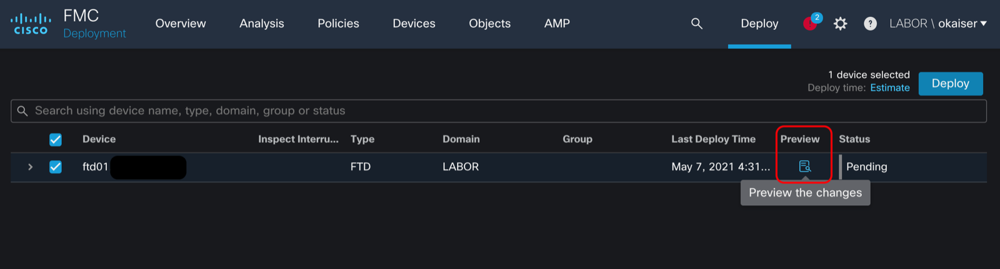 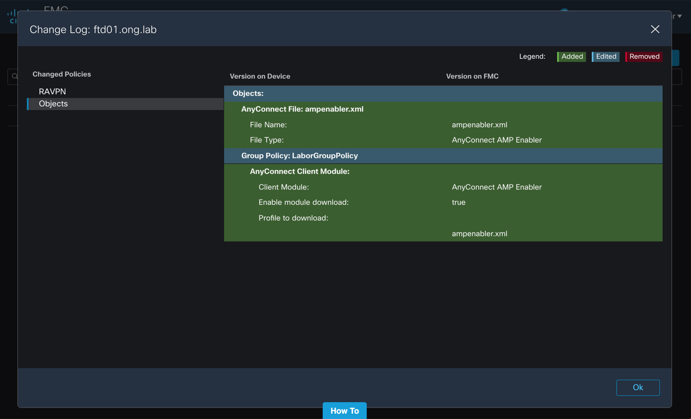

You should see the new profile file and an edited Group Policy. If everything looks alright you can go ahead and deploy your configuration

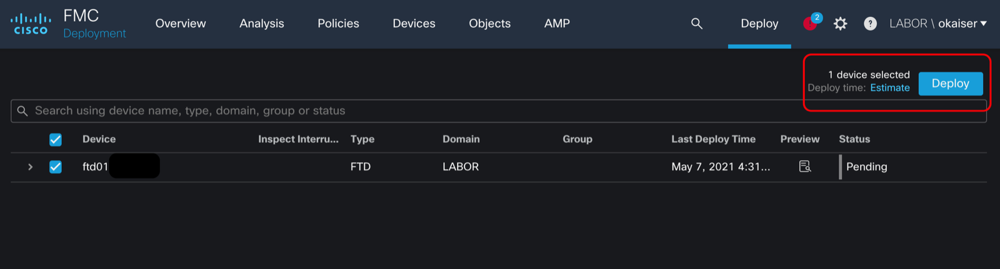

</details>

### \#5 Start new AnyConnect session

Now that everything is ready let’s switch to a client and try to connect via AnyConnect

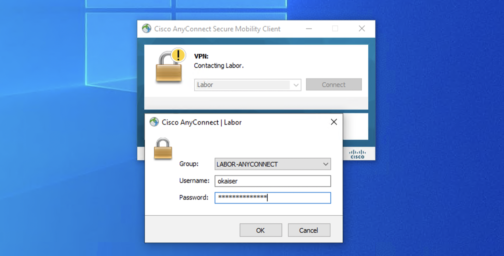

After successfully authenticating the AMP enabler module will be installed automatically. It will try to reach out to the server we specified in the xml profile…

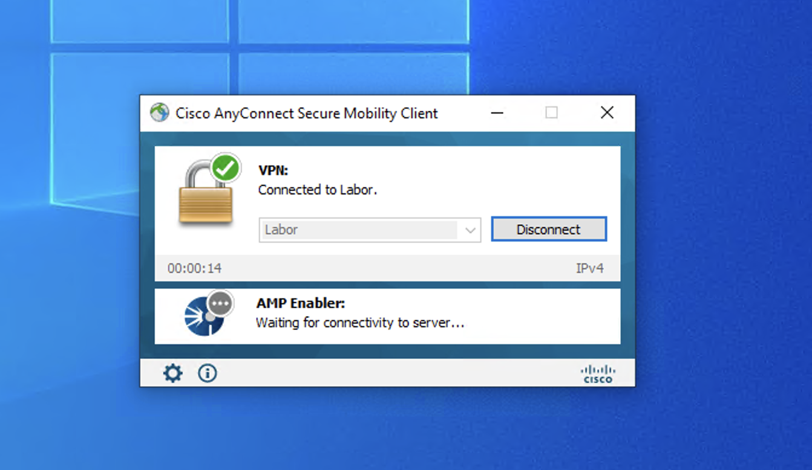

If the webserver is reachable it will download the amp installer to the client

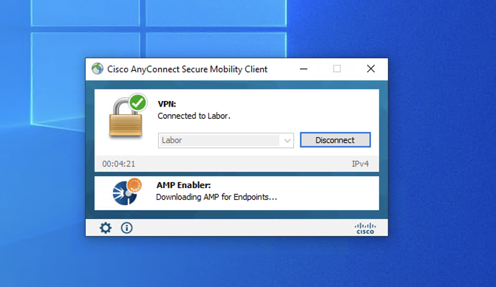

When the download is completed the module will automatically install AMP Connector

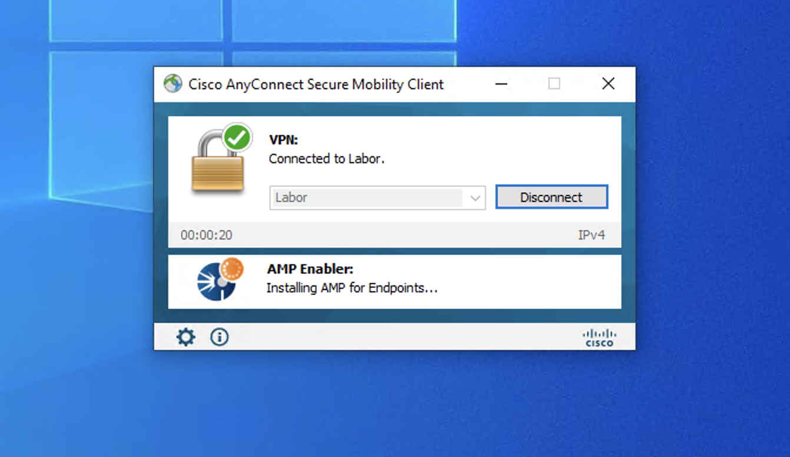

### \#6 Verify that AMP for Endpoints has been installed successfully

The AMP Connector installation should finish in a few minutes. If everything is working correctly you should be greeted with the connectors UI automatically.

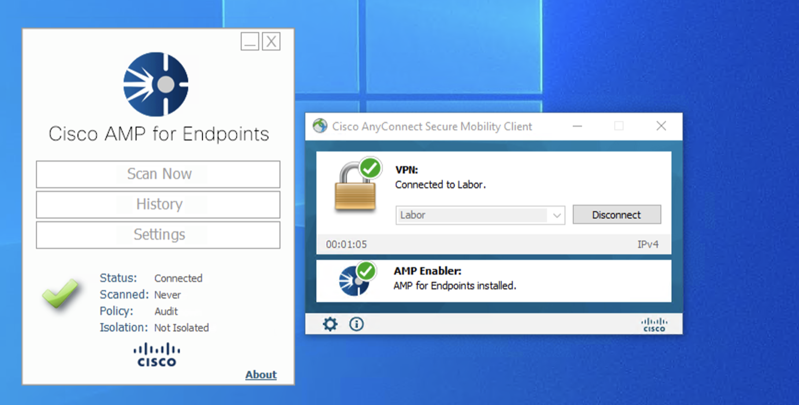

Just to make sure that the client is indeed connected to our AMP console let’s hop back into the cloud dashboard and navigate to **Management \> Computers**

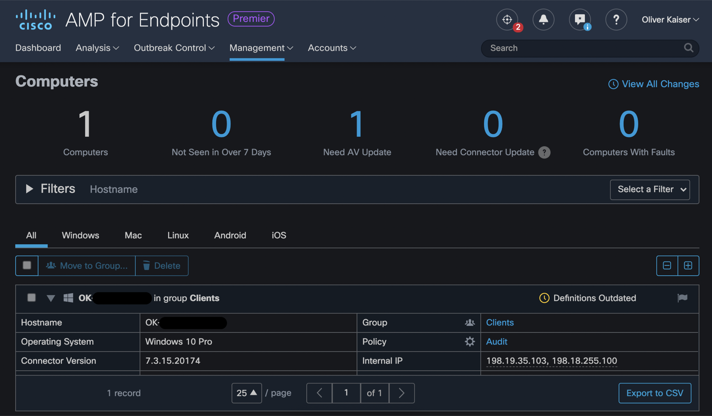

That’s it – Rolling out AMP for Endpoints using AnyConnect is as simple as it looks like. Just put your installer on a webserver, add some configuration on ASA/FTD and wait for your users to connect to the VPN to get them enrolled automatically.
