It’s been five years since the last major Firepower software release. Back in 2015 Cisco launched Firepower 6.0 which included their new **NGFW** offering **Firepower Threat Defense**. After ironing out major issues and getting closer to feature parity with ASA (I am looking at you AnyConnect) **Firepower 7.0** is the next big overhaul, introducing a **completely rewritten detection engine** (Snort 3) and a lot of anticipated improvements to the existing software. In this post we will look at everything that has changed paired with some commentary about what I think about those changes. With that said let’s take a look at some highlights…

## Firepower 7.0 Highlights

### Snort 3

6.7.0 introduced Snort 3 support for Firepower Device Manager (FDM) and 7.0 finally added the option to change from Snort 2 to the completely rewritten detection engine Snort 3. The goal of Snort 3 was to create a more flexible packet processing framework that should retain a similar packet processing functionality as Snort 2. The new software architecture introduces a multi-threaded design that utilizes a **single control thread** and **multiple packet processing threads**. The advantage of this approach is that Snort 3 utilizes a single rule table, configuration and shared network map, which results in a lot less memory consumption and quicker snort reloads when deploying configuration changes.

Apart from the performance improvements Snort 3 also includes a new rule language that is more flexible and easier to read. One major advantage of the new rules is that network and port definitions are no longer mandatory, resulting in a leaner intrusion ruleset and less duplicate rules (hence also freeing up memory for other intrusion rules).

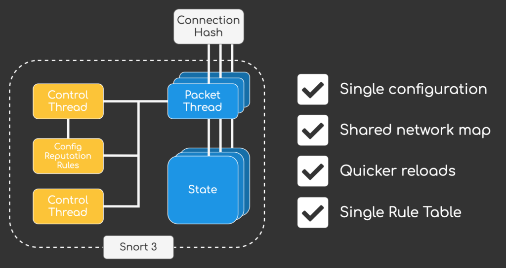

If you are interested in all this changes introduced with Snort 3 you can checkout my post [Snort 3 Deep Dive – The Future of Cisco Firepower](/posts/snort-3-deep-dive-the-future-of-cisco-firepower/) to learn more.

### Major performance improvements

A lot of improvements have been added with 7.0.0, resulting in up to 30% performance improvements for Firepower Threat Defense (across AVC, IPS and VPN). One feature worth mentioning is **Intel QuickAssist Technology (QAT)** support for TLS inspection and VPN, which is probably the reason for the increase in VPN performance. I am really looking forward to the updated Datasheets that should be available in June to see the final numbers.

### Dynamic Network Objects

Up until 7.0.0 network objects were static configuration that we had to deploy via FMC for changes to take affect on FTD. For dynamic environments like Public Clouds (AWS, Azure, GCP) or even on-premise solutions like Cisco ACI or VMware NSX this meant that we could not work with dynamic attributes that were mapped to ip addresses but had to rely on static network objects. Changes to those objects always had to be deployed from FMC to our firewalls, leaving us with no way to stream changes instantaniously to our firewalls.

Dynamic Objects are a generic implementation of what we already know from the **Cisco ISE integration with pxGRID**. While we already had the option of synchronising attributes from ISE and using them in our Accesspolicy, when it came to third party integrations there was no way to have changes in systems like Microsoft Azure to automatically (and instantly (!)) propagate to our firewalls.

7.0.0 solves this issue by introducing dynamic objects, that can be defined either via UI or new REST API call that was added to FMC. I think this new feature will be a major game changer. For now we are only handed the capabilities and not some full fledged out-of-the-box integrations into other solutions. I am really looking forward to future integrations both from the communtiy and other vendors but also from Cisco, so we can start defining policies solely on attributes and go away from environments that only rely on static ip address definitions.

### A lot of AnyConnect features…

While AnyConnect has been available since 6.2.3 there were still a lot of important features missing. With 7.0.0 the gap between ASA and FTD is finally getting very, very slim. 7.0.0 includes the following enhancements for FTD managed by FMC:

- Dynamic Access Policies (DAP)
- Dynamic Split-Tunneling
- VPN Load Balancing
- Local User Authentication
- Multi-cert support for Authentication
- AnyConnect Custom Attributes
- Per-app VPN for mobile devices
- AnyConnect Update deferal
- GET REST API for AnyConnect features

While some of the features listed here were available through FlexConfig, it was about time that we finally see some native FMC UI support. Up until 6.7.0 I would have still recommended to go with ASA if a firewalls only purpose was to provide remote-access, but with 7.0.0 we finally have all the tools that should have been there with 6.2.3 already… Management of AnyConnect modules, DAP, LDAP authorization, etc. making FTD a viable AnyConnect gateway for all sorts of deployments.

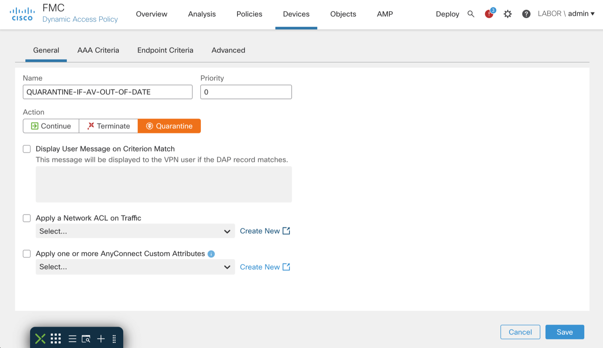

## Honorable mentions

Snort 3 and the big performance gains are definetely my highlights with AnyConnect improvements and Dynamic Network Objects coming in second for me. But apart from that there is still a long list of additional integrations and enhancements that deserve a mention:

### SecureX Ribbon integration

Cisco is moving its SecureX XDR vision one step closer out from Powerpoint into reality by adding an additional integration with 7.0.0. So far we were able to send all security events via **Secure Services Edge** (SSE) to SecureX, but with 7.0.0 we also have the option of integrating the ribbon interface into Firepower Management Center.

Not sure what the “Ribbon” is? It’s this:

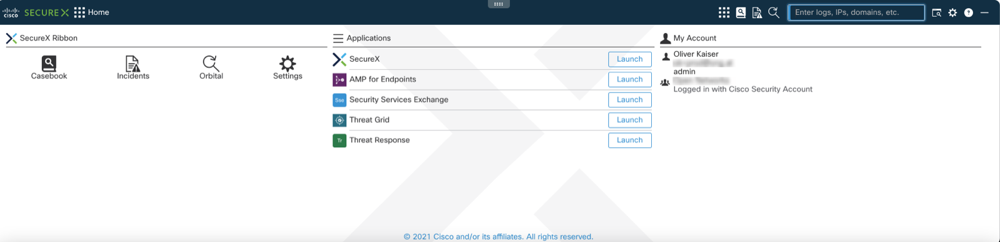

The idea is to have a common UI element across all Cisco Security products enabling us to define casebooks, enrich them with data from different solutions and have a more unified experience when doing some investigations.

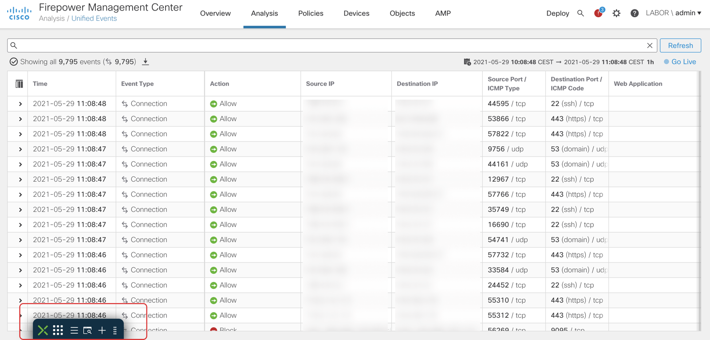

It might be a minor enhancement, but I think it is important since we can observe that integrations into the whole SecureX ecosystem are consistently being added across products giving us a more unified and integrated system rather than point solutions that exist side-by-side. The next step will probably be for Cisco to invest more heavily into SecureX Orchestration to also enable automation across on-premise solutions like Identity Service Engine and Firepower.

### FMC Stealthwatch Analytics and Logging

6.7.0 first introduced integration of FMC with SAL. As you may know FMC can only handle so many connection events before rotating its datastore making it not feasable as a long term storage solution for environments with a lot of network events. SAL bridges that gap by forwarding all events to Stealthwatch Analytics and Logging and acting as a query backend to FMC. While 6.7.0 only supported connection events 7.0.0 also adds s**upport for all security events and FTD-LINA syslog events**. It also adds a new integration wizard and support for FMC domains.

Especially for large environments I see some real usecases for SAL as long term storage for Firepower installations. Maybe at some point in time it will be an integral part of logging for Firepower setup, but we’ll see about that.

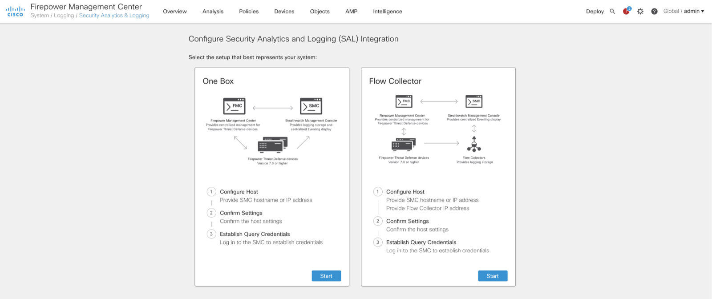

### FMC REST API enhancements

Firepower 7.0.0 adds **over 80 (!) new REST API calls** including CRUD operations for DHCP Relay, Realms, DAPs, Intrusion Policies (and rules!), Network Analysis Policies, Local realm users, Dynamic Objects, SecureX configuration, Application filters and GET operations for AnyConnect related configuration.

The list is quite extensive, and I guess I’ll be occupied with some additions to [FireREST](https://github.com/kaisero/fireREST) to make working with the API and Python easier for me and hopefully for some other people out there.

### Unified Event Viewer

The Unified Event Viewer aggregates Connection, File, Malware and Intrusion Events into a single view. By introducing a searchbar on the top of the page (no more page redirects!) and a **realtime mode** the new event viewer is a great addition to all operators out there:

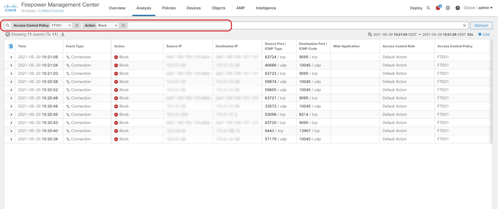

Analysis of connection events has been quite a pain in prior releases. To filter results you were redirected to another page and if you wanted to change the timeframe a popup opened up – Thankfully User Experience pains like that no longer exist with the new Unified Event Viewer.

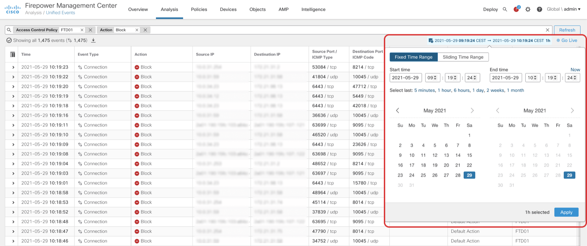 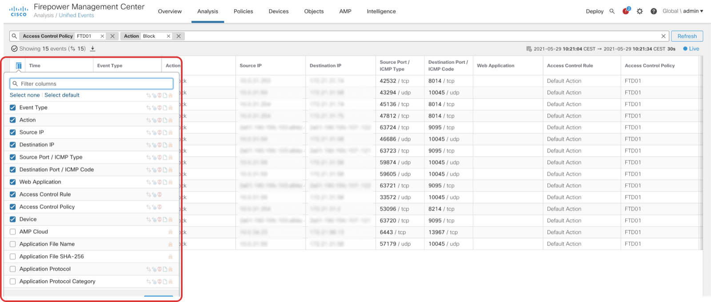

### Global Search

A new feature that is available from the navigation bar allows us to search across Policies, Objects and all UI elements within FMC, making it easier to find your configuration across all the different pages on FMC.

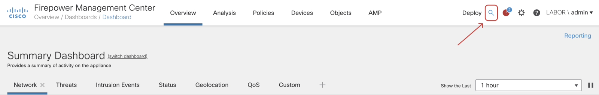 , Objects and Policies")

No more clicking through various screens to find what you are looking for. Just search for the configuration elements or features you want to use and get a result instantly.

### Unified Health Monitoring

Firepower 7.0.0 builds on the Unified Health Monitoring introduced in Firepower 6.7.0 and enhances it with many little details that were only available on the CLI before. It now includes FMC metrics, FTD HA Split Brain detection and support for Azure Application Insights. By adding native support for Azure APplication Insights FTD is now able to directly interact with Microsoft Azure to provide health information to the Azure cloud.

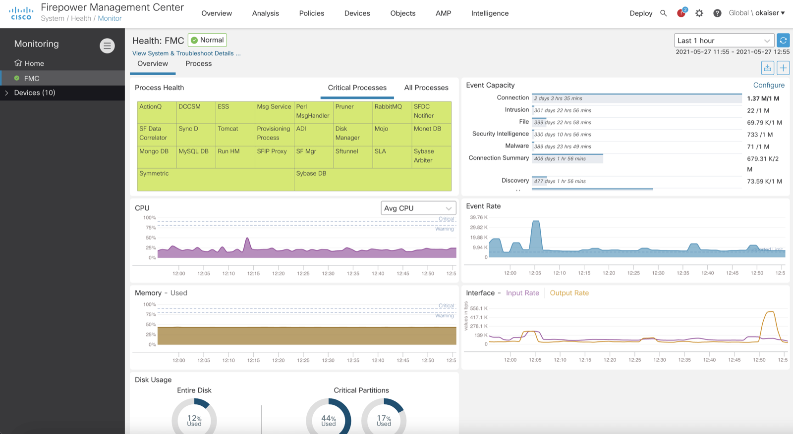

The new dashboard is a great addition for troubleshooting. Not only does it give us a quick overview of the current health but also some insights into event capacity and rates – numbers that could only be calculated from metrics found via CLI.

### Deployment enhancements

The deployment page includes a lot of new enhancements to better understand who did what change and when. It is now possible to **display a diff from the deployment history** and filter deployments by user and device. Additionally we are now able to **selectively deploy vpn configuration** and **rollback the last 10 configuration deployments.** I am happy that we are finally seeing a rollback option, but keep in mind that it is a **disruptive** operation. It’s basically an operations that clears the whole configuration and activates a old snapshot.

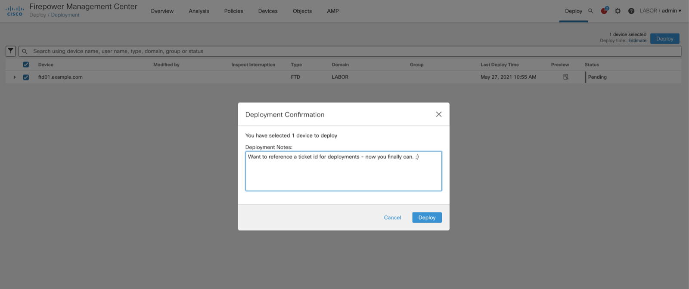 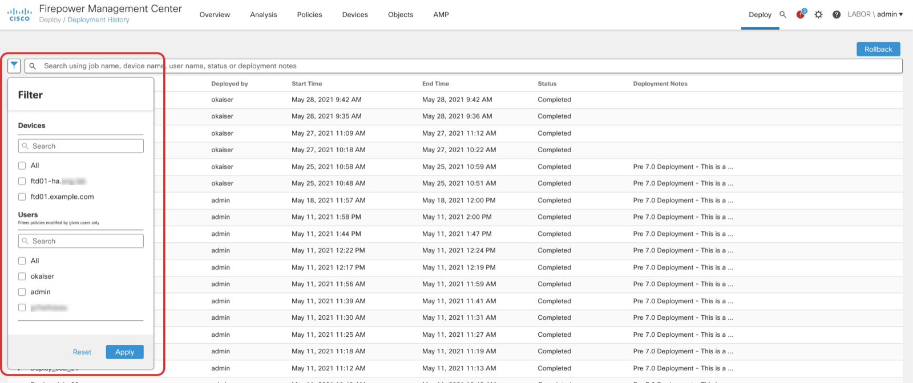

## Release notes

This post is only a summary of the changes introduced in 7.0.0. There are a lot more additions, so if you are looking for the full release notes head over to software.cisco.com or use the following links for the full details:

<https://www.cisco.com/c/en/us/td/docs/security/firepower/70/relnotes/firepower-release-notes-700.html>
