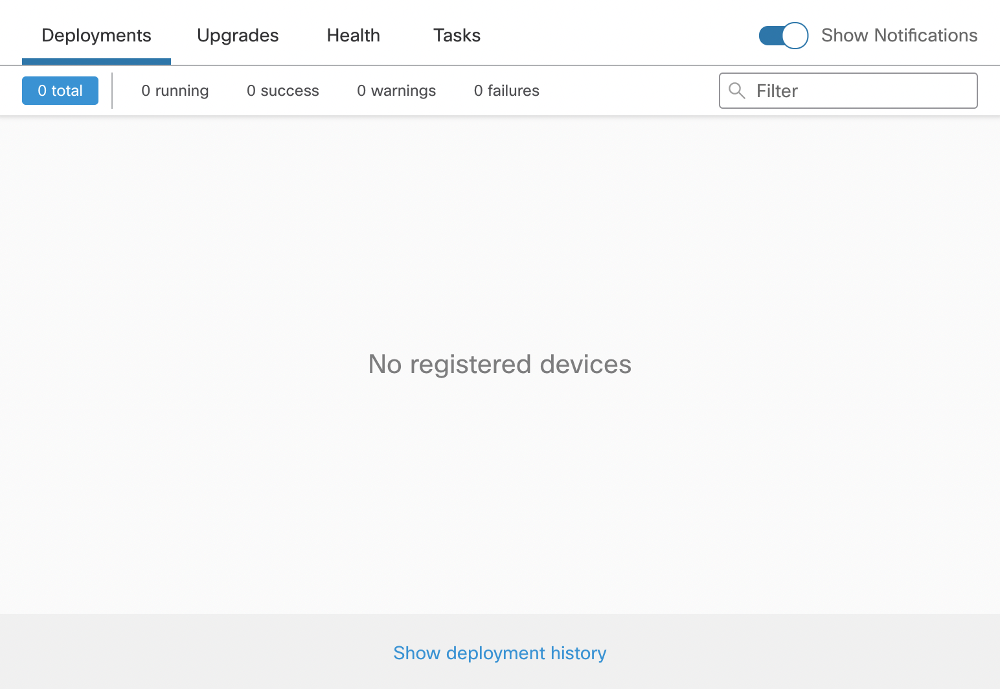

Every now and then tasks get stuck on Firepower Management Center. Even though there are mechanisms in place that should cancel long running tasks after a timeout is reached this problem has persisted for a quite some time (source: I’ve seen it happening for more than 5 years).

Engaging **TAC** to resolve the problem manually is the **only officially supported solution**, but doing it yourself is relatively safe in my opinion. I have executed the CLI procedure I am listing here for years without any issues, just keep in mind that you are deleting data directly from the systems database, which might not be a very smart move if you do not understand the inner working of the software you are trying to beat into submission.

Make sure you only use this procedure as a last resort. Various tasks have different timeout settings. If a deployment is running for 15 minutes it’s not a smart move to delete the tasks from the FMC database, since this will not stop the running deployment, but only makes FMC unaware of it!

Possible reasonable usecases for following this guide are configuration deployment that ran for multiple hours, backup jobs that already failed but are still stuck in the task view for multiple days…


The procedure for deleting hanging tasks differs between software releases since Cisco changed the database backend from Mysql/MariaDB to Sybase
 <details open>
<summary>&gt;= 6.3.0</summary>

Step 01: Switch to bash (expert) shell and change to root user

``` bash
> expert
 admin@fmc01:~$ sudo su -
```

Step 02: Execute OmniQuery.pl to search for running tasks

``` bash
root@fmc01:~#  OmniQuery.pl -db mdb -e "select status,category,hex(uuid) from notification where status=7;"
+--------+-------------------+----------------------------------+
| status | category          | hex(uuid)                        |
| 7      | task:category.150 | bb0bba970b4c4423927b8f7d237edd0b |
+--------+-------------------+----------------------------------+
1 rows in set
```

Step 03: Copy the uuid of your task and delete it from Sybase using OmniQuery.pl:

``` bash
root@fmc01:~#  OmniQuery.pl -db mdb -e 'delete from notification where uuid=unhex("bb0bba970b4c4423927b8f7d237edd0b");'
Query OK, 1 rows affected (0.000 sec)
```

Step 04: Double-check to make sure the entry was successfully deleted from notification table

    OmniQuery.pl -db mdb -e "select status,category,hex(uuid) from notification where status=7;"

    Empty set (0.001 sec)

Step 05: Restart FMC Processes for changes to take effect

    root@fmc01:~#  /etc/rc.d/init.d/console restart

</details>

<details>
<summary>&lt;= 6.2.3</summary>

Step 01: Switch to bash (expert) shell and change to root user

``` bash
> expert
 admin@fmc01:~$ sudo su -
```

Step 02: Execute mysql query to search for running tasks

``` bash
root@fmc01:~# mysql -padmin -uroot sfsnort -e "select status,category,hex(uuid) from notification where status=7;"
+--------+-------------------+----------------------------------+
| status | category          | hex(uuid)                        |
| 7      | task:category.150 | bb0bba970b4c4423927b8f7d237edd0b |
+--------+-------------------+----------------------------------+
1 rows in set
```

Step 03: Copy the uuid of your task and delete it from the database:

``` bash
root@fmc01:~# mysql -padmin -uroot sfsnort -e "delete from notification where uuid=unhex("bb0bba970b4c4423927b8f7d237edd0b ");"

 Query OK, 1 rows affected (0.000 sec)
```

Step 04: Double-check to make sure entry was successfully deleted from notification table

    root@fmc01:~# mysql -padmin -uroot sfsnort -e "select status,category,hex(uuid) from notification where status=7;"

    Empty set (0.001 sec)

Step 05: Restart FMC Processes for changes to take effect

    root@fmc01:~#  /etc/rc.d/init.d/console restart

</details>

After your FMC has successfully restarted, login to the UI and make sure the task / deployment is no longer listed:


