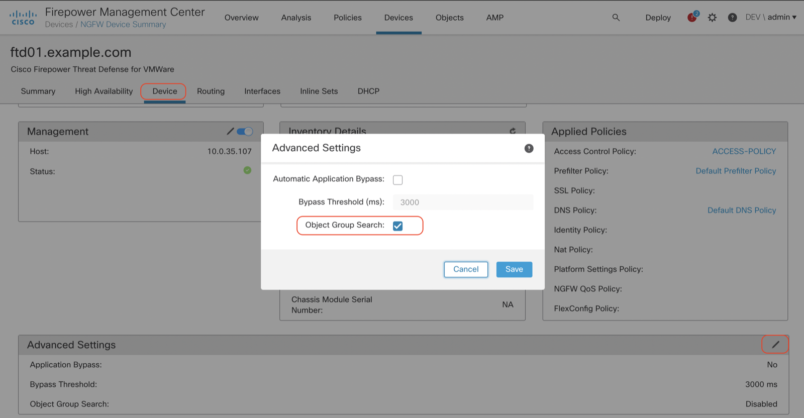

Ever wondered how many access-list items are supported on Firepower Threat Defense? Just like ASA, Firepower Threat Defense uses the same concept of ACEs (Access-Control Entries) for its stateful inspection firewall engine (LINA). Each access control entry consists of a 5-tuple (Source IP, Destination IP, Source Port, Destination Port and Protocol), with each entry using a minimum of 212 bytes of memory.

## Why should I care?

212 bytes of memory sounds like a drop in a pond, but think of it like this. For each source/destination ip address and each source/destination ports within a rule the number of access-control entries are being multiplied. Take the following example:

| Source IP  | Source Port | Destination IP | Destination Port | Protocol |
|------------|-------------|----------------|------------------|----------|
| 198.18.1.1 | 1000        | 198.19.1.1     | 80               | TCP      |

By multiplying the number of entries in each fields we get the number of ACEs that will be generated:\
**1 (Source IP) x 1 (Source Port) x 1 (Destination IP) x 1 (Destination Port) x 1 (Protocol) = 1**

Let’s take a more realistic rule that can be found on a lot of firewalls – permitting Active Directory access from different network segments to a variety of domain controllers

<table>
<colgroup>
<col style="width: 20%" />
<col style="width: 20%" />
<col style="width: 20%" />
<col style="width: 20%" />
<col style="width: 20%" />
</colgroup>
<thead>
<tr>
<th>Source IP</th>
<th>Source Port</th>
<th>Destination IP</th>
<th>Destination Port</th>
<th>Protocol</th>
</tr>
</thead>
<tbody>
<tr>
<td>198.18.1.0/24 
198.18.2.0/24 
198.18.3.0/24 
198.18.4.0/24 
198.18.5.0/24 
198.18.6.0/24 
198.18.7.0/24</td>
<td></td>
<td>198.19.1.1 
198.19.1.2 
198.19.1.3 
198.19.1.4 
198.19.1.5 
198.19.1.6 
198.19.1.7</td>
<td>53 
88 
135 
389 
636 
3268 
3269</td>
<td>TCP</td>
</tr>
</tbody>
</table>

By doing the same simple math yet again we multiply all our entries and end up with quite a lot of ACEs\
**7 (Source IP) x 7 (Destination IP) x 7 (Destination Port) x 1 (Protocol) =** 343

Now you might understand why the maximum number of recommended access-control entries can be quite important when sizing a Firepower Threat Defense deployment… or atleast it was a lot more important before Firepower 6.6.0 was released.

## Object-Group Search to the Rescue

Since the expansion of rules can cause a lot of AC entries to be created, a new feature was introduced to solve (or move?) the problem of high memory usage to the Firewalls CPU. Using the OGS feature object-groups will not be expanded upon configuration deployments, but be resolved using a lookup procedure at runtime. This way the amount of memory required to load AC entries can be decreased while the burden is pushed on the CPU to resolve the objects referenced in your accesspolicy.

**OGS is disabled by default** and in case FMCs Health Monitoring does not indicate any memory shortages on the Firewall side I would recommend leaving it turned off. However if you are ever get into a situation where your ruleset is too large for the underlying hardware you can just enable OGS in Device settings (just make sure your CPU is not at its limit as well):

## Recommended Limits by Hardware

| Platform             | Recommended Limit |
|----------------------|-------------------|
| ASA 5506-X           | 12.500            |
| ASA 5508-X           | 50.000            |
| ASA 5516-X           | 125.000           |
| ASA 5525-X           | 150.000           |
| ASA 5545-X           | 250.000           |
| ASA 5555-X           | 250.000           |
| ASA 5585-X (SSP-10)  | 500.000           |
| ASA 5585-X (SSP-20)  | 750.000           |
| ASA 5585-X (SSP-40)  | 1.000.000         |
| ASA 5585-X (SSP-60)  | 2.000.000         |
| Firepower 1010       | 15.000            |
| Firepower 1120       | 125.000           |
| Firepower 1140       | 150.000           |
| Firepower 1150       | 250.000           |
| Firepower 2110       | 50.000            |
| Firepower 2120       | 75.000            |
| Firepower 2130       | 300.000           |
| Firepower 2140       | 375.000           |
| Firepower 4110       | 2.250.000         |
| Firepower 4115       | 2.500.000         |
| Firepower 4120       | 2.250.000         |
| Firepower 4125       | 2.750.000         |
| Firepower 4140       | 2.250.000         |
| Firepower 4145       | 3.000.000         |
| Firepower 4150       | 3.000.000         |
| Firepower 9300 SM-24 | 2.250.000         |
| Firepower 9300 SM-36 | 2.250.000         |
| Firepower 9300 SM-40 | 6.000.000         |
| Firepower 9300 SM-44 | 3.000.000         |
| Firepower 9300 SM-48 | 6.000.000         |
| Firepower 9300 SM-56 | 6.000.000         |

Do you want to know how many ACEs your configuration currently consists of? Just SSH to your FTD device and execute the following handy command:

`show access-list | include elements`
