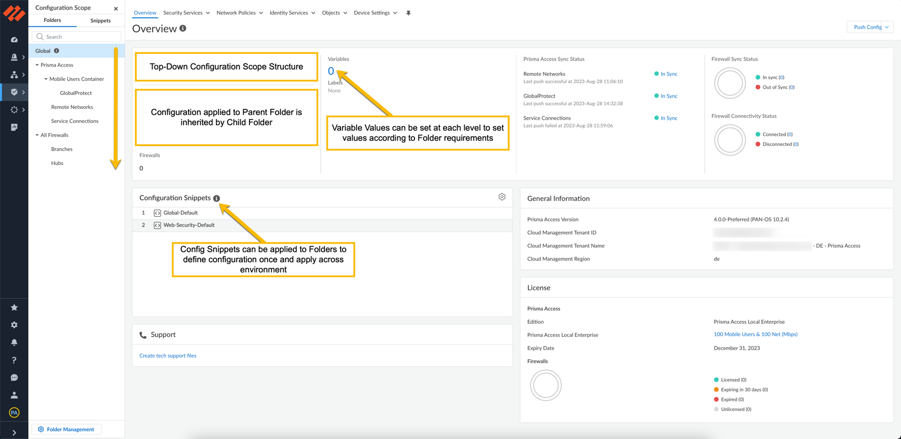
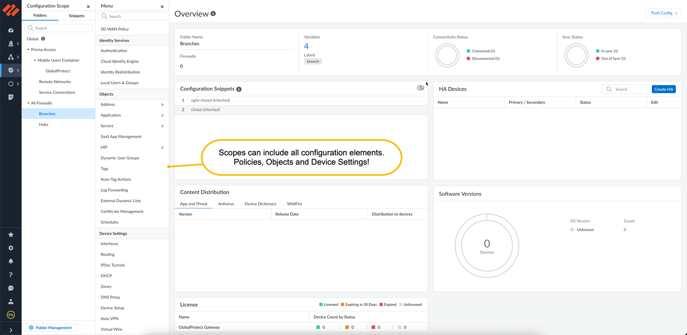
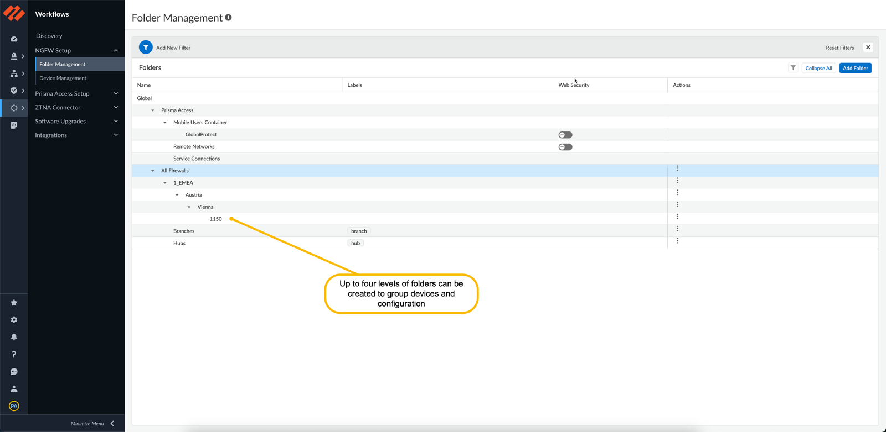
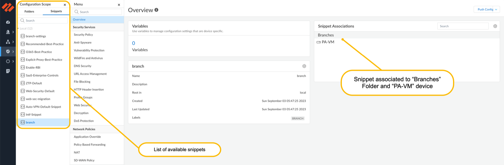
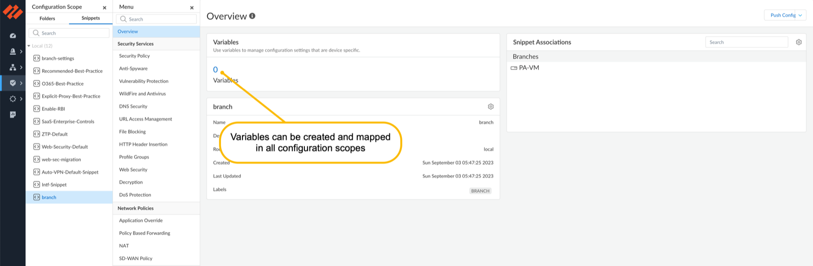
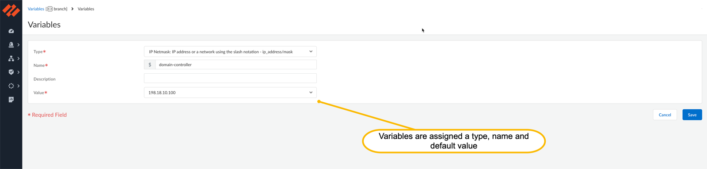
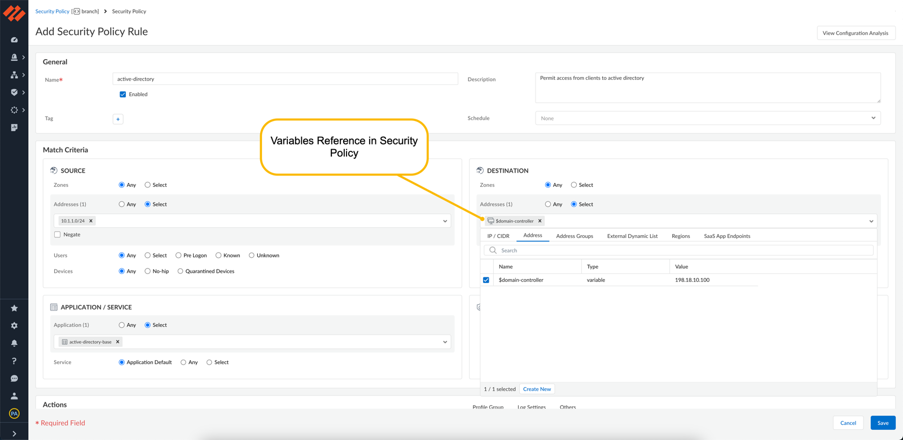

Strata Cloud Manager is a new AI-Powered Network Security platform to manage your on-prem NGFW network security stack and Prisma Access. By combining Prisma Access Cloud Management with Palo Alto Networks AIOps monitoring solution Strata Cloud Management (SCM) enables users to manage and monitor their whole SASE environment from a single UI, all through a simple easy-to-use SaaS Cloud solution.

In this post we will have a look at the new configuration concepts introduced with Strata Cloud Manager, how to onboard a new PA-Series device and what SCM has to offer to simplify network security operations.

# Snippets, Folder and Variables

While Panorama uses the concept of Device Groups, Templates and Template Stacks to apply configuration to NGFW devices, SCM uses configuration scopes to apply settings to Prisma Access and/or NGFW devices. Using a hierarchical structure, policy can be applied on a **Global** scope affecting both Prisma Access and NGFW devices or only on specific components within your NetSec stack.

 
If you have worked with Panorama before you will notice that configuration scopes can include all NGFW configurations. Device Group and Template settings are unified in a single configuration structure – Configuration Scopes



## Folders

Folders are used to define configuration that is inherited by members of the folder. Members can be either other folders (with up to four levels of folders) or NGFW Devices. Having a sophisticated inheritance structure can be useful to apply policy simply through placing a device in the correct folder I would recommend to start out small to keep over engineered complexity at bay.

## Snippets

While it is convenient to use inheritance to apply configuration through folders, it may lack flexibility for certain scenarios (i.e. if you want apply a certain security policy only to a subset of devices within a folder)… and that is exactly where Snippets come into play. A snippet is a configuration scope that can be defined once and applied to Folders or Devices.

 
A possible use case to utilise a configuration snippet might be to enable an additional feature like TLS Decryption. Imagine you want to rollout TLS Decryption across all your sites but you want to do so in a phased manner. Create your best-practice tls decryption configuration once within a snippet and apply it to devices or folders one by one.


## Variables

To accommodate for device or deployment specific values variables can be used. Folders and Snippets can be augmented by defining variables. Values are set either in the configuration scope where the variable is defined or can be overridden at the Folder or Device level.

A key differentiator in comparison to Panorama is that variables can also be referenced in security policies, hence a generic policy snippet can be created that contains variables that are set by the configuration context to which the snippet is applied.

  

# Using Strata Cloud Manager to configure a NGFW

Want to learn more about how to onboard a device into SCM? Look forward to the 2nd post in this series around Strata Cloud Manager scheduled for the 7th of January 2024.
