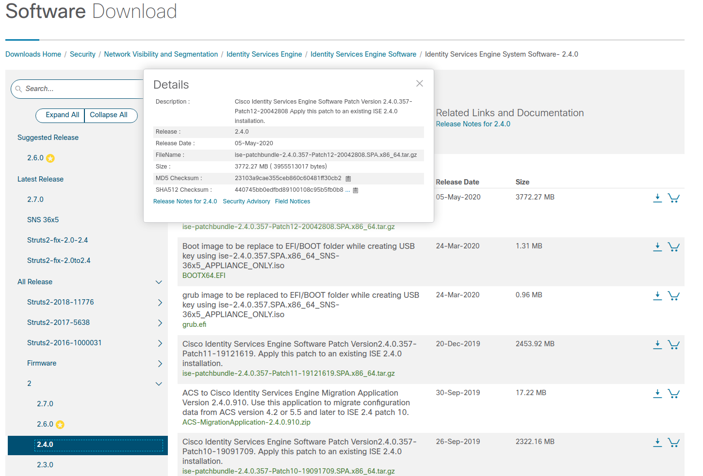
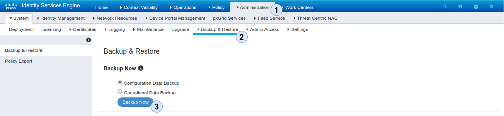
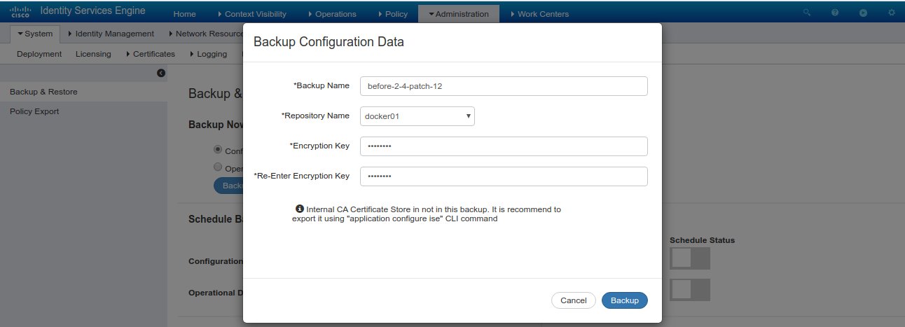
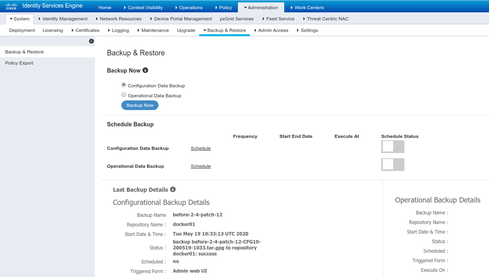

Although it is easier to update ISE through the graphical user interface in this post we will use the command-line for patching ISE to the latest 2.4 software release. An advantage of utilizing the CLI is that we can control the order in which to install the patch to different nodes which is being taken care of automatically if the GUI is used to update ISE.


ISE patches are cumulative. You can directly upgrade to the latest patch release


## Preperation

Before updating ISE make sure you go over all the steps for a smooth upgrade expierence.

### Checksum verification

Making sure the patch file is not corrupted could cost you quite some time during a maintenance window. Verifying the file is quite easy and can be done by generating an md5 checksum from the update file and comparing it to the hash listed on the Cisco download page

``` bash

md5sum ise-patchbundle-2.4.0.357-Patch12-20042808.SPA.x86_64.tar.gz
23103a9cae355ceb860c60481ff30cb2
```

After generating the hash navigate to the Cisco Download page and compare it to the md5 hash listed when you hover over the update file.



### Application status

Having a basic idea of which processes should be running is a good indicator for verifying that the update has completed successfully. A patch release should not include any new features, so the processes you see running after the upgrade should match the ones that were running before the update process.

``` bash
ise/admin# show application status ise

ISE PROCESS NAME                       STATE            PROCESS ID
--------------------------------------------------------------------
Database Listener                      running          12937
Database Server                        running          98 PROCESSES
Application Server                     running          20062
Profiler Database                      running          15154
ISE Indexing Engine                    running          21693
AD Connector                           running          23072
M&T Session Database                   running          14940
M&T Log Collector                      running          20364
M&T Log Processor                      running          20265
Certificate Authority Service          running          22821
EST Service                            running          29203
SXP Engine Service                     disabled
Docker Daemon                          running          16012
TC-NAC Service                         disabled

Wifi Setup Helper Container            disabled
pxGrid Infrastructure Service          disabled
pxGrid Publisher Subscriber Service    disabled
pxGrid Connection Manager              disabled
pxGrid Controller                      disabled
PassiveID WMI Service                  disabled
PassiveID Syslog Service               disabled
PassiveID API Service                  disabled
PassiveID Agent Service                disabled
PassiveID Endpoint Service             disabled
PassiveID SPAN Service                 disabled
DHCP Server (dhcpd)                    disabled
DNS Server (named)                     disabled
ISE RabbitMQ Container                 running          16313
```

### Backup

Always make sure you have an up2date backup before proceeding with the update. Of course there are many quality assurance tests that are run on the vendors side but not having an option to restore after a failed upgrade (for example due to power loss or a bug in the update bundle) can be quite a pain, so make sure you generate a backup file

  

### Upload update

To upload the package we will use a sftp repository on a management server and define a disk repository which we will reference later to upload the update file to

``` bash
ise/admin# configure terminal
ise/admin(config)# repository mgmtsrv
ise/admin(config-Repository)# url sftp://<ipaddress>
ise/admin(config-Repository)# user <username> password plain <password>
```

``` bash
ise/admin(config)# repository disk
ise/admin(config-Repository)# url disk:
```

After defining the repository we need to add the ssh host key to ise

``` bash
ise/admin# crypto host_key add host 10.0.31.131
host key fingerprint added
# Host 10.0.31.131 found: line 1
10.0.31.131 RSA SHA256:dJh4nkb0LRfpWZgHCrBiX+FMQSeZmhHPT9jCj0u+xXE
```

Last but not least we can upload the package form `mgmtsrv` to the local `disk`repository

``` bash
ise/admin# copy sftp://<ipaddress>/ise-patchbundle-2.4.0.357-Patch12-20042808.SPA.x86_64.tar.gz disk:/
Username: okaiser
Password: ****
```

## Installation

After taking care of all the prerequsites we can finally go ahead and install the latest patch.


**Warning**

ISE will restart after patch installation


``` bash
ise01/admin# patch install ise-patchbundle-2.4.0.357-Patch12-20042808.SPA.x86_64.tar.gz disk
```

``` bash
% Warning: Patch will be installed only on this node. Install using Primary Administration node GUI to install on all nodes in deployment. Continue? (yes/no) [yes] ? yes
Save the current ADE-OS running configuration? (yes/no) [yes] ? yes
Generating configuration...
Saved the ADE-OS running configuration to startup successfully
Initiating Application Patch installation...

Getting bundle to local machine...
Unbundling Application Package...
Verifying Application Signature...
Patch successfully installed

% This application Install or Upgrade requires reboot, rebooting now...
Broadcast message from root@ise01 (pts/1) (Tue May 19 11:47:36 2020):

The system is going down for reboot NOW
```

### Verification

After ISE is up and running again we can login to cli again and verify that the patch was installed successfully and all service are up and running again

``` bash
ise01/admin# show application version ise

Cisco Identity Services Engine
---------------------------------------------
Version      : 2.4.0.357
Build Date   : Thu Mar 22 19:01:26 2018
Install Date : Wed Jan 16 13:45:08 2019

Cisco Identity Services Engine Patch
---------------------------------------------
Version      : 5
Install Date : Fri Jan 18 19:25:00 2019

Cisco Identity Services Engine Patch
---------------------------------------------
Version      : 12
Install Date : Tue May 19 11:46:27 2020
```

    ise/admin# show application status ise

    ISE PROCESS NAME                       STATE            PROCESS ID
    --------------------------------------------------------------------
    Database Listener                      running          7246
    Database Server                        running          113 PROCESSES
    Application Server                     running          15037
    Profiler Database                      running          9420
    ISE Indexing Engine                    running          16668
    AD Connector                           running          20423
    M&T Session Database                   running          9172
    M&T Log Collector                      running          15363
    M&T Log Processor                      running          15246
    Certificate Authority Service          running          17818
    EST Service                            running          18154
    SXP Engine Service                     disabled
    Docker Daemon                          running          10390
    TC-NAC Service                         disabled

    Wifi Setup Helper Container            disabled
    pxGrid Infrastructure Service          disabled
    pxGrid Publisher Subscriber Service    disabled
    pxGrid Connection Manager              disabled
    pxGrid Controller                      disabled
    PassiveID WMI Service                  disabled
    PassiveID Syslog Service               disabled
    PassiveID API Service                  disabled
    PassiveID Agent Service                disabled
    PassiveID Endpoint Service             disabled
    PassiveID SPAN Service                 disabled
    DHCP Server (dhcpd)                    disabled
    DNS Server (named)                     disabled
    ISE RabbitMQ Container                 running          11501
