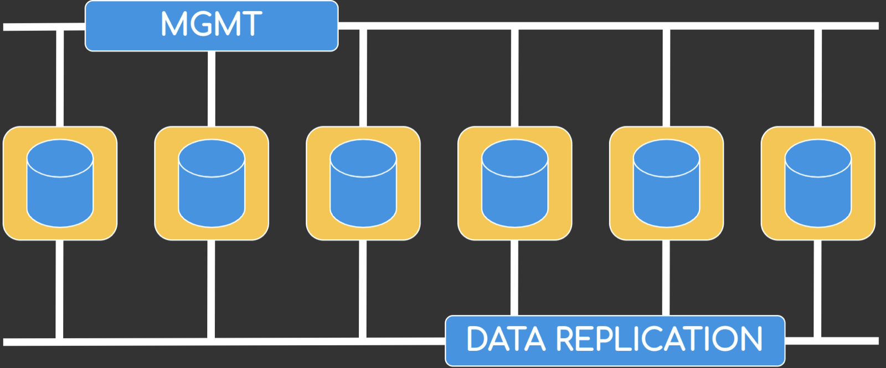

Up until 7.2.3 Secure Network Analytics (formely Stealthwatch) used a pretty straight forward approach to scaling flow collection and storage. If you required additional storage or had to handle additional flows that were too much for your existing flow collector(s) to handle, you wouldjust deploy another Flow Collector. It was a simple solution, but there were also a few drawbacks to it. Just think of a scenario where your flow collectors were sized to handle a certain number of flows per second (FPS) but you needed more storage capacity to store events for a longer duration of time. The only solution was to deploy another flow collector and re-distribute the load, so the new collector would hold a portion of the data that was handled by the old collector recently. Doesn’t sound like a satisfying solution, right? Fortunetely the Secure Network Analytics Team thought so as well and released **Data Store**, a new Stealthwatch appliance that makes independent scaling a lot easier, while boosting the systems overall performance significantly.

## What is Data Store and why should I care?

Stealthwatch Data Store decouples flow ingestion from data storage by providing new dedicated systems which are only responsible for storing and replicating data. With Data Store, Flow Collectors only ingest and deduplicate flow data, while long term storage is handled by redundant Data Store appliances. This new approach makes scaling long term storage a lot easier and centralizes storage to a single, redundant system made up of a minimum of three physical or virtual appliances. While the virtual form factor is currently limited to a maximum of three systems the physical appliances can consist of up to 36 nodes.

## How does Data Store work?

Flow Collectors ingest flows into Stealthwatch Data Stores, with each flow being saved on two different datastore nodes. This means that in case of node failure a data store unit can be replaced without dataloss, giving us a lot more resiliency as compared to the old Flow Collector model where data is stored locally without any copies elsewhere.

Stealthwatch Data Store utilizes a dedicated inter-node communication network for replicating the folow data. From what I have found so far this network is basically a dedicated VLAN that is used for replicating data between nodes. It looks like for now there is no way to use a routed network for inter-node data replication, which might be an issue if you are thinking about a geo-redundant datastore setup over a routed network. If you ever run into a situation like that I would recommend using dedicated Data Store Clusters for each site.

## Ok – So it decouples collection from data retention, anything else?

Probably the most important change with Data Store is that query and reporting response times improve can improve by orders of magnitude. Up until now SMC had to query each Flow Collector for relevant data, but with Data Store we finally have a centralized data repository that offers significant improvements with an average of **23% quicker query times**. That number also dramatically increases for queries with a long timespan. Tasks that would have taken hours should go down to minutes, but do not take my word for it – if you are struggling with long query times at the moment take Data Store for a test drive, it’s definetely worth it!

## Form Factors – Let’s go virtual?

Data Store is available as physical appliance or VM. While the physical appliances support **up to 36 nodes**, the virtual deployment is currently limited to a maximum of 3 nodes. A single Data Store is able to handle up to 220.000 FPS so going virtual is probably the way to go for a lot of smaller enterprises.

If you want to calculate the storage size required for storing flow data for X number of days you can use the following formula from the SNA 7.2.3 configuration guide:

**\[\[(daily average FPS/1,000) x 1.6 x days\] / number of Data Nodes**

Let’s assume you are seeing 10.000 FPS and want to retain one year of data using three virtual Data Stores you end up with th following formula:

**\[\[(10.000/1.000) x 1.6 x 365\] / 3 = 1,94TB**

## Possible Future of Data Store / Stealthwatch

Having a central datastore for security related network telemetry data is a great addition to Secure Network Analytics, but I hope it’s just the beginning of various integrations into the Stealthwatch ecosystem. The first step was providing a scalable storage solution (Stealthwatch Data Store), the second was ingestion of third party data (Firepower logs using SAL) and the third step would be using that data with the existing machine learning intelligence to produce more meaningful correlations, policies and alarms.

I think it would be interesting to see Stealthwatch become the central telemetry repository for solutions like ISE, Secure Firewall, Secure E-Mail and Secure Endpoint – using all that data Stealthwatch could probably produce a lot of meaningful insights… or atleast a single console to query logs across the whole security portfolio without logging into dozens of different consoles.
