Like many other software solutions Secure Network Analytics (formely known as Stealthwatch) uses self-signed certificates by default to secure communication between its Management Console (SMC) and components like Flow Sensor, Flow Collector or Data Store. While a setup like this is acceptable for lab and testing environment it’s always a good idea to use your internal PKI to secure access with CA signed certificates. Not only do we enhance our security posture by ensuring we are using correctly parameterized certficates that adhere to our internal security policies but we also satisfy those pesky auditors.

In this post we will look at how we can secure **Stealthwatch 7.3.2** with CA signed certificates using a Windows CA. We will see the order in which we should replace our existing self-signed certificates and how Windows CA can be configured and used to sign our identity certificates quickly and reliably.

## Overview

The Enterprise PKI setup we will be utilizing in this posts consists of an offline Root CA based on OpenSSL and an online Intermediate CA based on Windows CA (Windows Server 2019). The Root CA (OpenSSL) is only responsible for generating Intermediate CA certificates while the Intermediate CA (Windows) is responsible for signing identity certificates for our Stealthwatch appliances.


This guide assumes that you already have a CA in place. We will only cover how to use an existing Windows CA to sign certificates! Flow Collector, Flow Sensor, Data Store and Management Console will be covered.


## Order of operations

The order in which certificates are being replaced is important. If you replace the existing self-signed certificates the communication between SMC and its managed components will be re-established. If your trust store is missing the required certificates communication may fail!

While the official [SSL/TLS Certificates for Managed Appliances 7.3](https://www.cisco.com/c/dam/en/us/td/docs/security/stealthwatch/certificates/SW_7_3_SSL_TLS_Certificates_for_Managed_Appliances_Guide_DV_2_0.pdf) guide gives us a very detailed guideline the basic steps will be the following:

1.  Create a certificate template for Stealthwatch appliances
2.  Generate CSRs for all appliances
3.  Sign CSRs
4.  Import certificates to appliance truststore
5.  Import identity certificates

The identity certificates must be replaced in the following order:

1.  Data Store
2.  UDP Director
3.  Flow Collector 5000 Series Database
4.  Flow Collector 5000 Series Engine
5.  Flow Collector
6.  Flow Sensor
7.  Endpoint Concentrator
8.  Secondary SMC
9.  Primary SMC

For our lab setup only a subset of the appliances will be covered giving us the following order:

1.  Data Store
2.  Flow Collector
3.  Flow Sensor
4.  Primary SMC


The configuration guide does not cover Data Store yet. While I did not experience any issues with replacing Data Store certificates first the configuration guide does not explicitly mention that Data Store certificates should be replaced first!


## \#1 Create a certificate template

To sign our Stealthwatch identity certificates we will create a new certificate template and make it available to the Windows Certification Authority Web Enrollment service. Stealthwatch requires both Server Authentication and Client Authentication attributes in the certificate, so make sure the template is correctly configured before proceeding to the next step!

Step 01: Open Certificate Authority

Connect to your Certificate Authority and open the CA management console – **certsrv.msc**

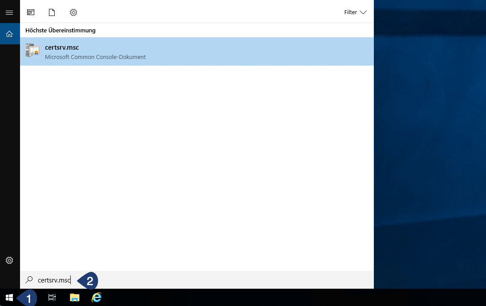

Step 02: Navigate to **Certificate Template**, right click in the templates window and select **Manage**

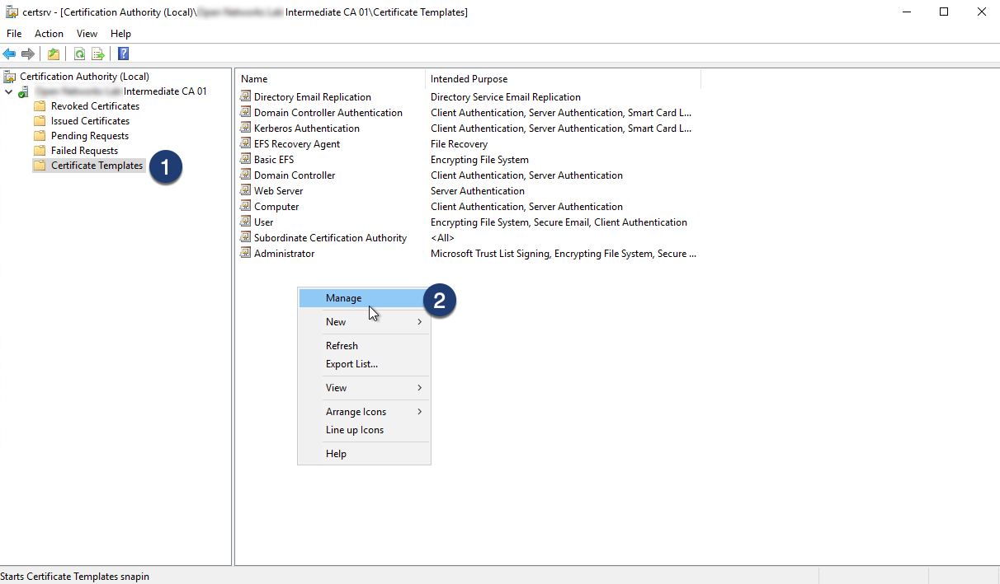

Step 03: Right-click the **Webserver** template and select **Duplicate Template**

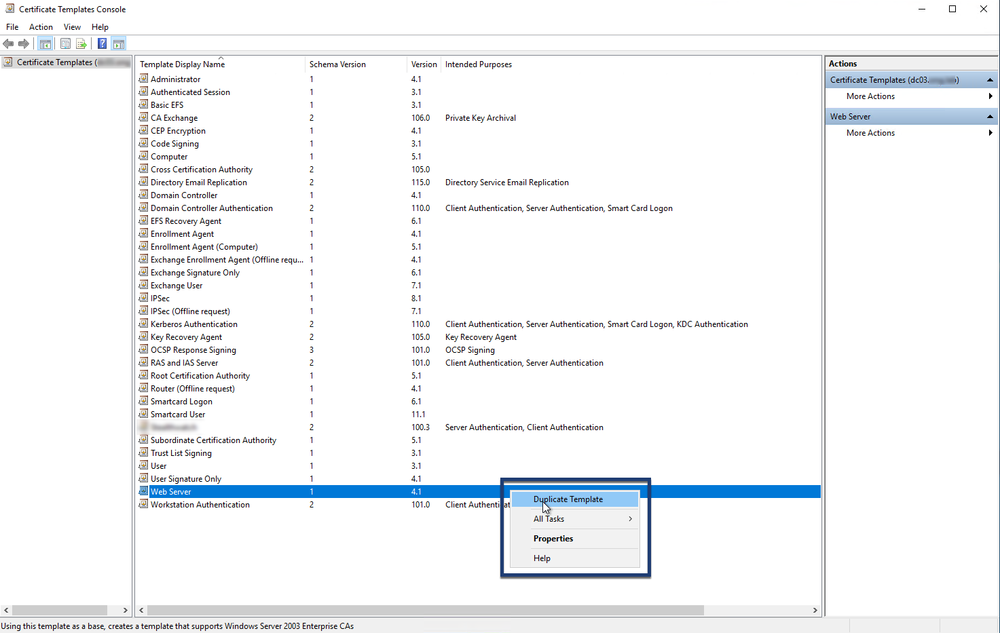

Navigate to the **General** tab, set a desired **Template display name** (i.e. Stealthwatch) and **validity period** (i.e. 1-5 years)

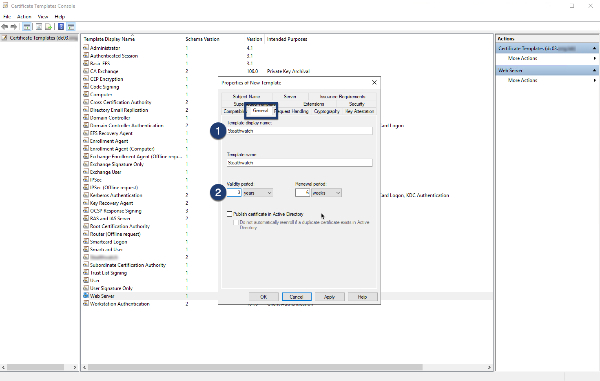

Step 04: Navigate to the **Extensions** tab and edit **Application Policies**

Stealthwatch identity certificates require the **Client Authentication** and **Server Authentication** extension!

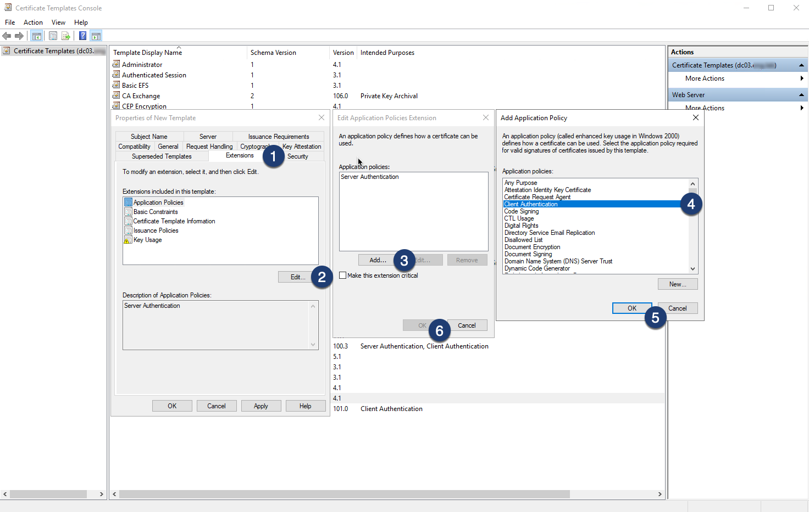

Step 05: Navigate to the **Security** tab, add the **Enroll** permission for your user and save template


**Warning**

If you do not follow this step you might not be able to select the template in the CAs web service!)
 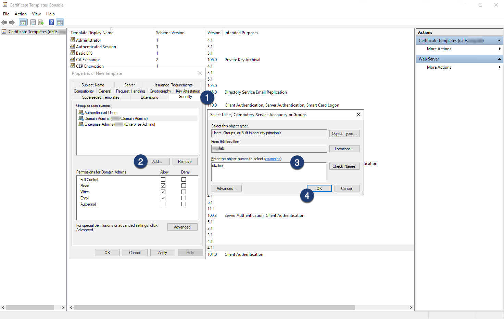 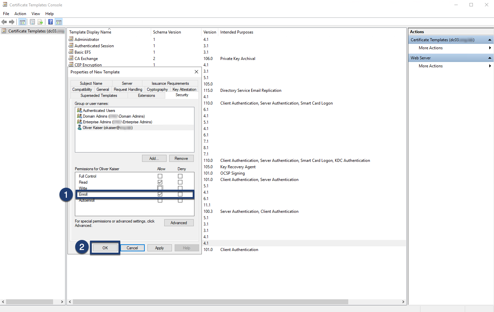 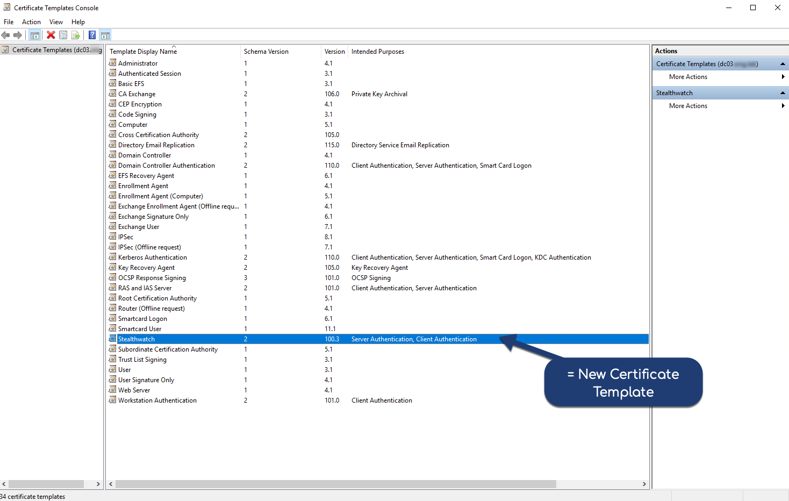

Step 07: Navigate back to **certsrv** and enable the certificate template

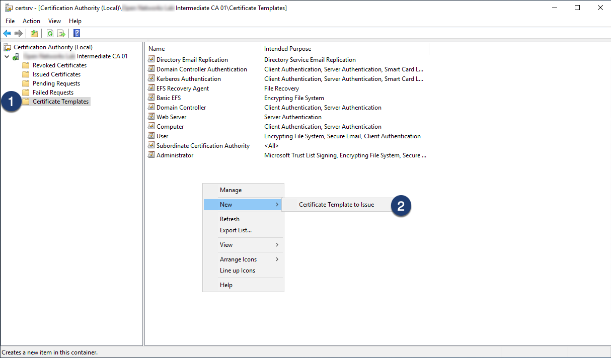 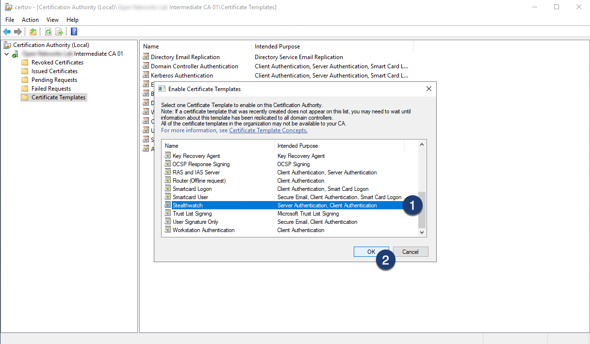

## \#2 Generate Certificate Signing Requests

You will need to generate CSRs for all appliances. Since the steps required to generate CSRs are identical for all device types I will only show how to generate a CSR for SMC. Do not forget to do the same for all other appliances!

Step 01: Navigate to **SSL/TLS Appliance Identity** configuration for each \$appliance

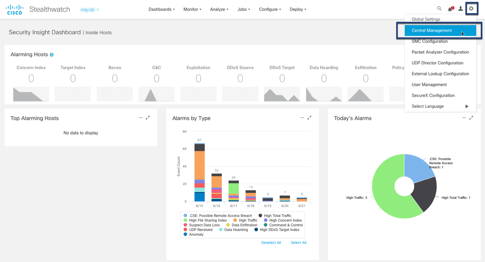 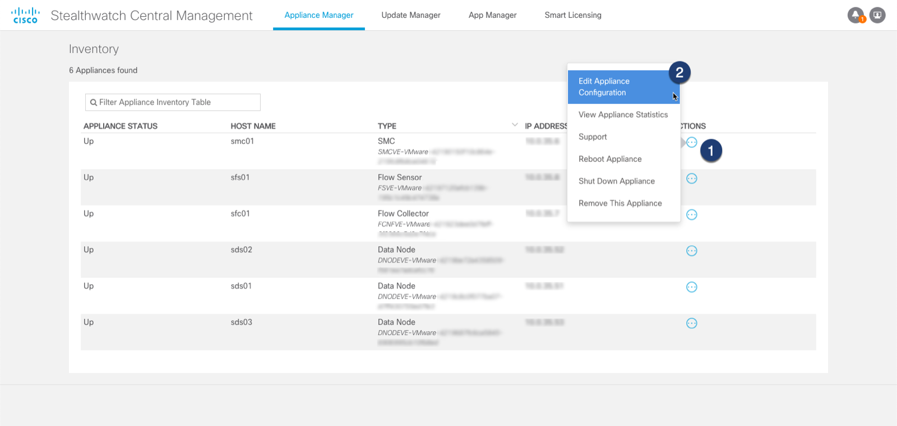

Step 02: Generate a new CSR (4096/8192 bit key length recommended)

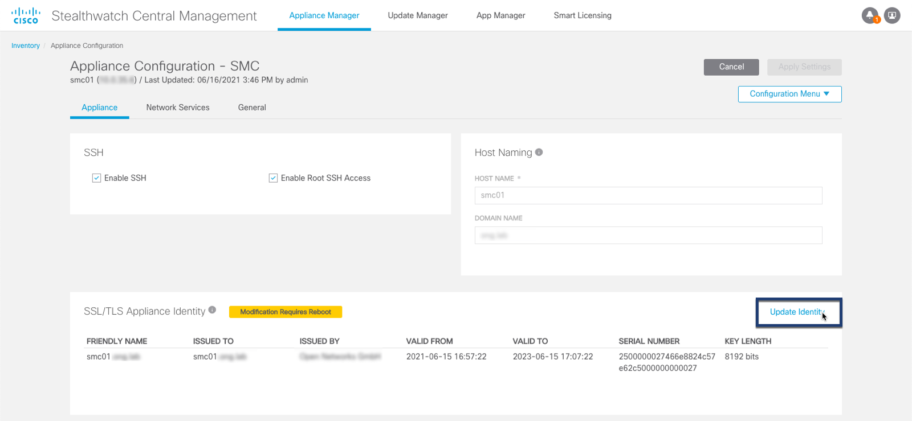 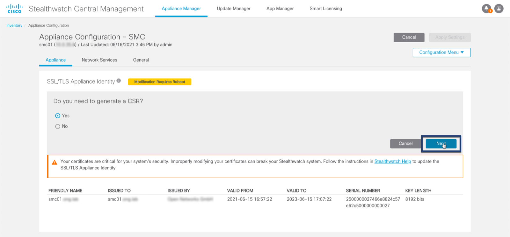 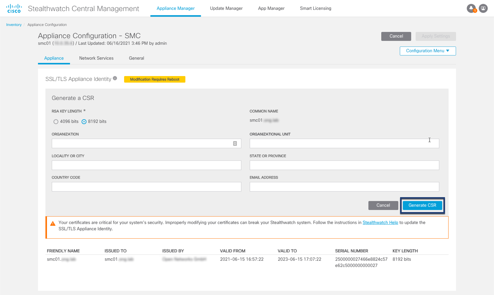

Step 03: Download CSR

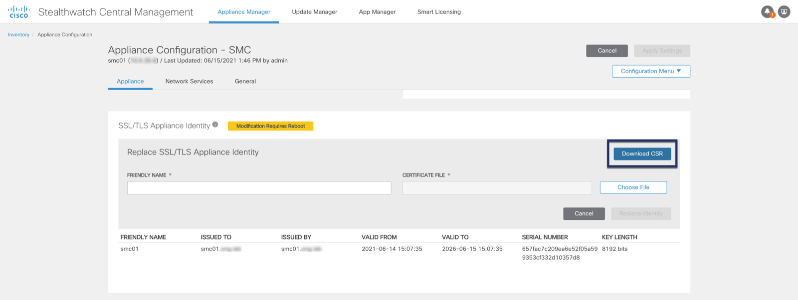

Now go back to **\#2 Generate Certificate Signing Requests** and generate CSRs for all remaining appliances.

## \#3 Sign Certificate Signing Requests

Time to sign the CSRs using Windows Certification Authority Web Enrollment service and download both signed certificates and the certificate chain (Certificates of both Intermediate CA and Root CA)

Step 01: Open your browser and navigate to CA Web Enrollment service (https://ca01.example.com/certsrv)

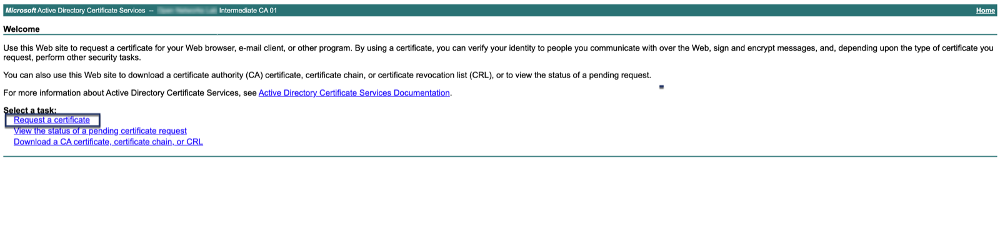

Step 02: Sign CSR using the appropriate certificate template

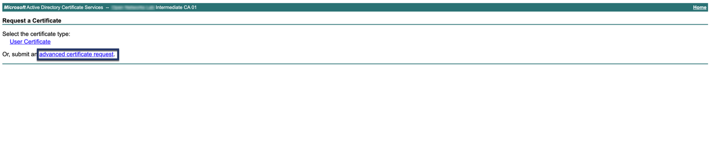 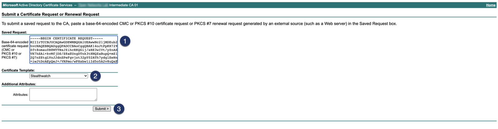

Step 03: Download signed certificate and certificate chain

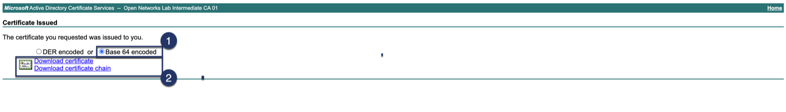 
**Tip**

Rename certificate files after download, having dozens of files named certfile.cert will get confusing quickly.


Step 04: Extract CA certificates from PKCS#7 file and create a chain in PEM format (required for Identity Certificate import)


This step required OpenSSL and should work on any Linux or OSX workstation. If you are using Windows you will need to install OpenSSL before proceeding


``` bash
openssl pkcs7 -print_certs -in certnew.p7b

 subject=/C=AT/ST=Vienna/O=Example/OU=Example Lab Certificate Authority/CN=Example Lab Intermediate CA 01
 issuer=/C=AT/ST=Vienna/O=Example/OU=IT/CN=Example Lab Root CA/emailAddress=support@example.com
 -----BEGIN CERTIFICATE-----
 (...) OMITTED INTERMEDIATE CA CERTIFICATE (...)
 -----END CERTIFICATE-----

 subject=/C=AT/ST=Vienna/O=Example/OU=IT/CN=Example Lab Root CA/emailAddress=support@example.com
 issuer=/C=AT/ST=Vienna/O=Example/OU=IT/CN=Example Lab Root CA/emailAddress=support@example.com
 -----BEGIN CERTIFICATE-----
 (...) OMITTED ROOT CA CERTIFICATE (...)
 -----END CERTIFICATE-----
```

    touch certificate-chain.pem
    echo "
     -----BEGIN CERTIFICATE-----
     (...) OMITTED INTERMEDIATE CA CERTIFICATE (...)
     -----END CERTIFICATE-----
    " >> certificate-chain.pem

    echo "
     -----BEGIN CERTIFICATE-----
     (...) OMITTED ROOT CA CERTIFICATE (...)
     -----END CERTIFICATE-----
    " >> certificate-chain.pem

Now that you have extracted the certificates create a PEM file in the following format:

     -----BEGIN CERTIFICATE-----
     (...) OMITTED INTERMEDIATE CA CERTIFICATE (...)
     -----END CERTIFICATE-----
     -----BEGIN CERTIFICATE-----
     (...) OMITTED ROOT CA CERTIFICATE (...)
     -----END CERTIFICATE-----

Step 06: Save both Intermediate CA and Root CA certificates in seperates files (required for Trust Store)

     -----BEGIN CERTIFICATE-----
     (...) OMITTED INTERMEDIATE CA CERTIFICATE (...)
     -----END CERTIFICATE-----

     -----BEGIN CERTIFICATE-----
     (...) OMITTED ROOT CA CERTIFICATE (...)
     -----END CERTIFICATE-----

You should have three files now. One containing the certificate chain (i.e. chain.pem), one containing only the root CA certificate (i.e. root-ca.pem) and one file containing only the intermediate ca certificate (i.e. intermediate-ca.pem).

Before proceeding to the next step make sure that you have generated all your identity certificates and extracted the certificate chain correctly. Follow step 1 through 3 for every appliance before continueing!

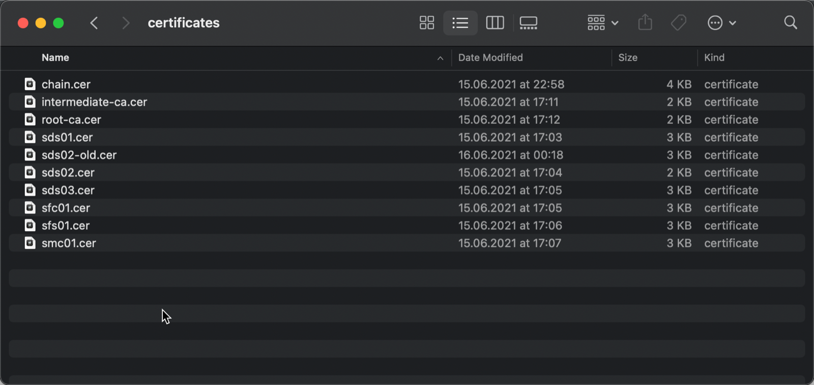

## \#4 Import certificates to appliance trust store

Now that our identity certificates are ready for use it’s time to update the trust store of each appliance. The trust store is a collection of certificates that the appliance considers trustworthy. Whenever a TLS connection is being established and a Stealthwatch appliance is being presented with a certificate it will check its certificate trust store to make sure that the certificate was signed by a trusted CA.

We will need to update the truststore for all appliances. The following table lists the required certificates that must be imported:

<table>
<colgroup>
<col style="width: 50%" />
<col style="width: 50%" />
</colgroup>
<thead>
<tr>
<th>Appliance</th>
<th>Certificate</th>
</tr>
</thead>
<tbody>
<tr>
<td>Management Console</td>
<td>Root CA<br />
Intermediate CA<br />
Management Console (self)<br />
Flow Collector<br />
Flow Sensor<br />
Data Store</td>
</tr>
<tr>
<td>Flow Collector</td>
<td>Root CA<br />
Intermediate CA<br />
Management Console<br />
Flow Collector (self)</td>
</tr>
<tr>
<td>Flow Sensor</td>
<td>Root CA<br />
Intermediate CA<br />
Management Console<br />
Flow Sensor (self)</td>
</tr>
<tr>
<td>Data Store</td>
<td>Root CA<br />
Intermediate CA<br />
Management Console<br />
Data Store (self)</td>
</tr>
</tbody>
</table>

The steps to import a certificate to the trust store are the following:

Step 01: Navigate to **Appliance Configuration**

 

Step 02: Open **Trust Store Configuration**

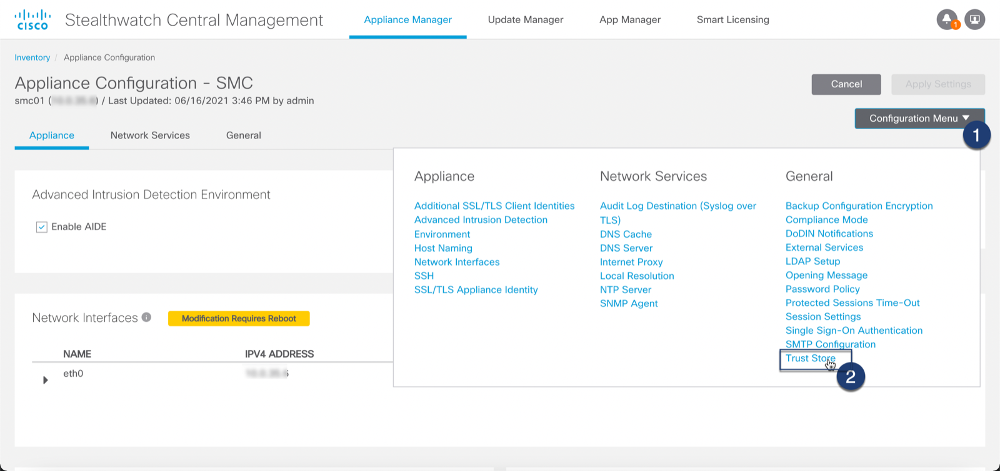

Step 03: Import certificate

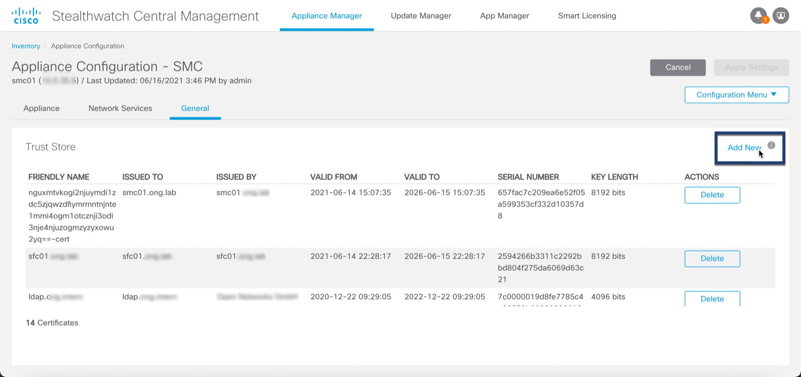 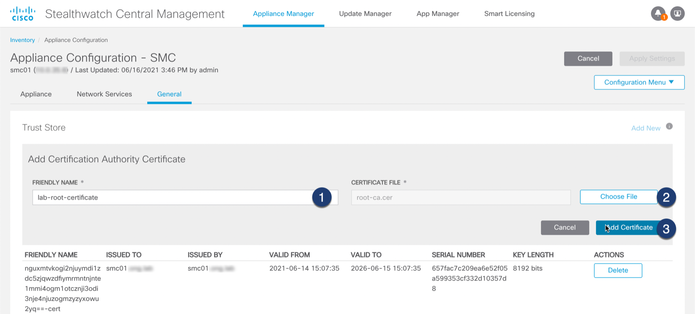

Step 04: Apply configuration

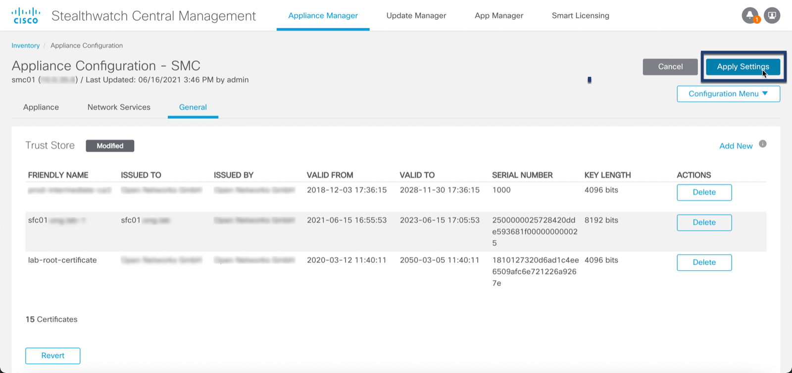

Before proceeding to the next step make sure that you have imported all trusted certificates according to the **Trust Store Requirements** table above!

## \#5 Import identity certificates

Last but not least we can finally replace our existing certificates. To do this we will once again go to Appliance configuration and replace identity certificates in the following order:

1.  Data Store
2.  Flow Collector
3.  Flow Sensor
4.  Primary SMC

Step 01: Navigate to **Appliance Configuration**

 

Step 02: Import signed certificate and certificate chain in PEM format

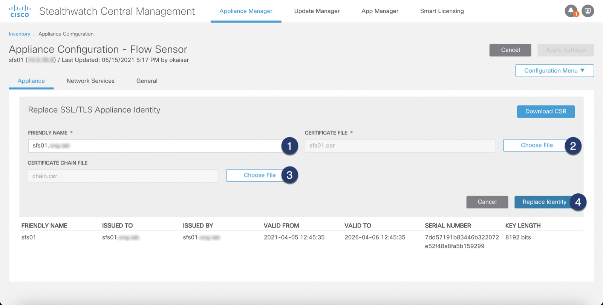

Step 03: Apply configuration


**Warning**

The webserver will restart after applying this configuration. Wait 5 minutes after applying the configuration and verify that the config channel between SMC and the other appliance is up again before proceeding to the next appliance!
 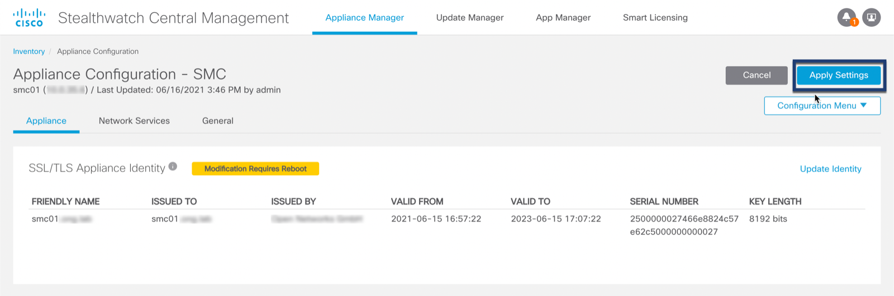 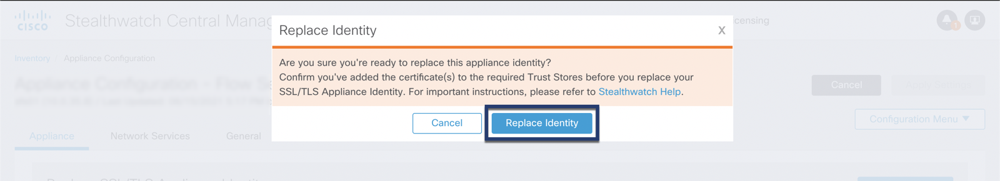

## \# 6 Verification

After importing your identity certificates you should see all appliances with state **Up** under Central Management. To verify that identity certificates were correctly replaced you can either use your browser and navigate to each appliance or use openssl via CLI:

<details open>
<summary>Browser (Chrome)</summary>

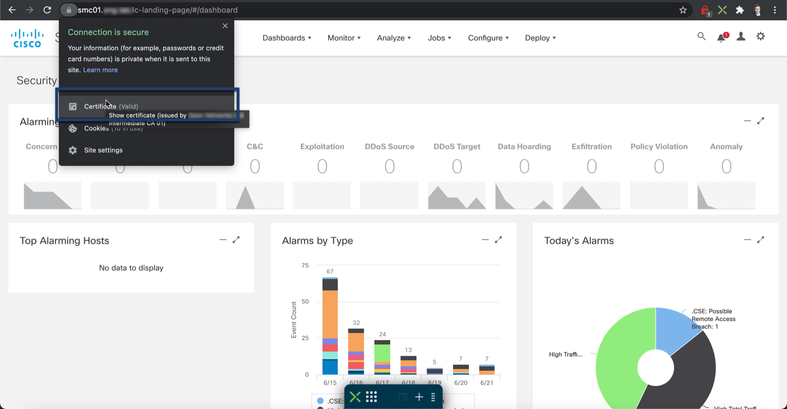 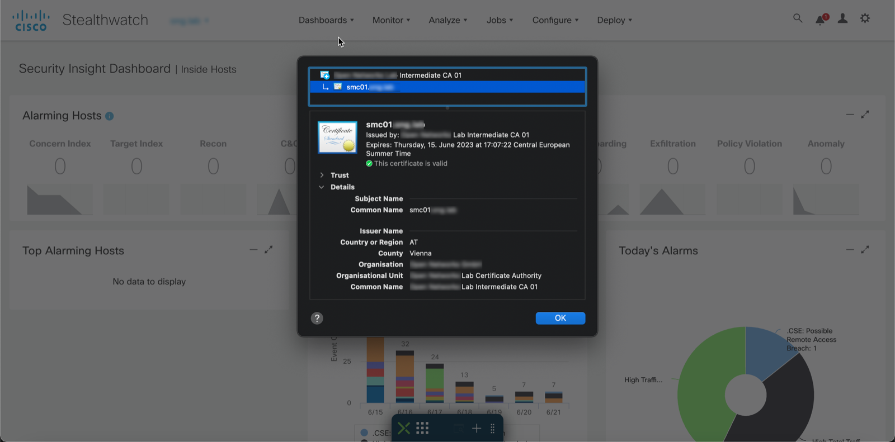

</details>

<details>
<summary>CLI (OpenSSL)</summary>

``` bash
echo | openssl s_client -showcerts -servername gnupg.org -connect smc01.ong.lab:443 2>/dev/null | openssl x509 -inform pem -noout -text

 Certificate:
     Data:
         Version: 3 (0x2)
         Serial Number:
             25:00:00:00:27:46:6e:88:24:c5:7e:62:c5:00:00:00:00:00:27
     Signature Algorithm: sha256WithRSAEncryption
         Issuer: C=AT, ST=Vienna, O=Example, OU=Example Company Certificate Authority, CN=Example Company Intermediate CA 01
         Validity
             Not Before: Jun 15 14:57:22 2021 GMT
             Not After : Jun 15 15:07:22 2023 GMT
         Subject: CN=smc01.example.com
         Subject Public Key Info:
             Public Key Algorithm: rsaEncryption
                 Public-Key: (8192 bit)
                 Modulus:
                 (...)
                 Exponent: 65537 (0x10001)
         X509v3 extensions:
             X509v3 Extended Key Usage: 
                 TLS Web Server Authentication, TLS Web Client Authentication
             X509v3 Subject Alternative Name: 
                 DNS:smc01.example.com, IP Address:198.18.0.100
             X509v3 Subject Key Identifier: 
                 25:E0:6C:13:42:40:B1:A4:E1:88:21:0B:E9:EE:DF:57:BA:D2:71:DF
             X509v3 Authority Key Identifier: 
                 keyid:1C:9C:0F:81:83:98:20:EE:B3:59:5D:CB:8D:C1:AB:B7:C6:9F:0D:36
             X509v3 CRL Distribution Points: 
                 Full Name:
  URI:ldap:///CN=Example%Company%20Lab%20Intermediate%20CA%2001,CN=dc03,CN=CDP,CN=Public%20Key%20Services,CN=Services,CN=Configuration,DC=example,DC=com?certificateRevocationList?base?objectClass=cRLDistributionPoint

             Authority Information Access: 
                 CA Issuers - URI:ldap:///CN=Example%Company%20Lab%20Intermediate%20CA%2001,CN=AIA,CN=Public%20Key%20Services,CN=Services,CN=Configuration,DC=example,DC=com?cACertificate?base?objectClass=certificationAuthority
      (...)
     Signature Algorithm: sha256WithRSAEncryption
     (...)
```

</details>
