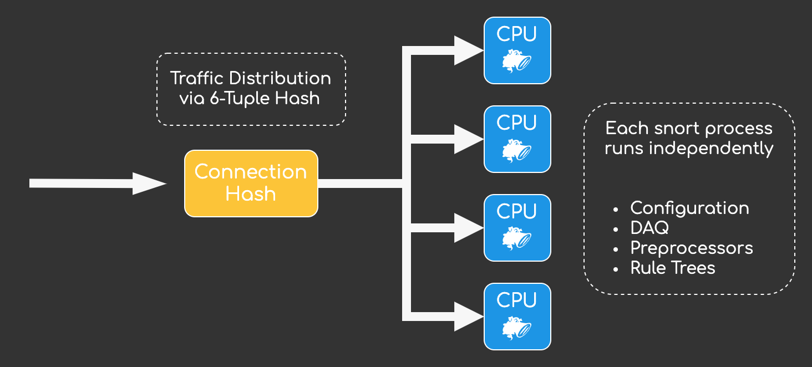
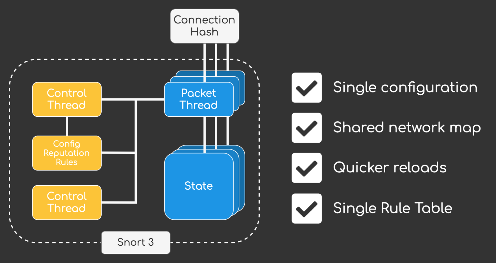
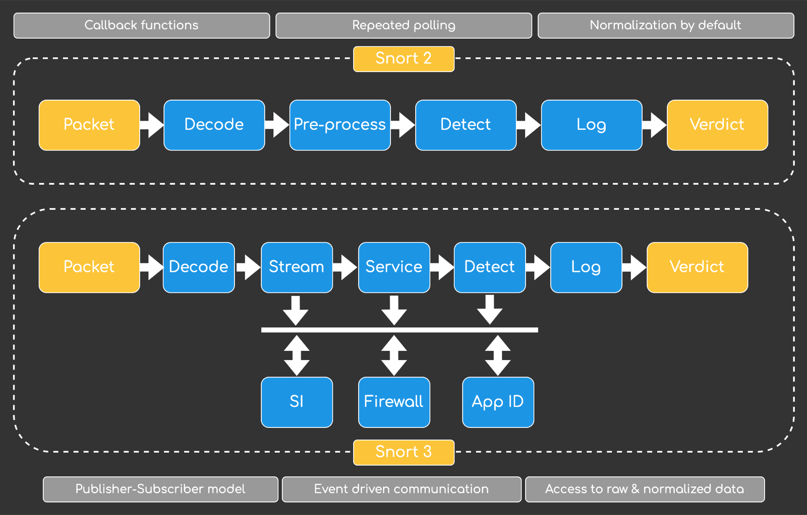

After **seven years of active development** Snort3 finally went GA in January 2021. It’s been eight years since Cisco aquired Sourcefire and integrated the Snort based IPS system into their **Firepower NGFW** solution. Probably for the last five years I’ve always seen the same question asked again and again – When will Snort3 be ready for primetime? Will it replace Snort2 in the Firepower solution in a timely manner and resolve all of the quirks of Snort2?

The answer is YES. When **Firepower 6.7.0** was released in November 2020, Snort3 was already integrated in Firepower Device Manager (FDM), and it is only a matter of time for FMC to follow suit. In this post we will explore new changes in Snort 3 and what it means for the future of Cisco Firepower.

## Snort 3 – A complete rewrite

Snort was created in **1998** by Martin Roesch, founder and former CTO of Sourcefire. And that is probably everything you need to know in regards to why a rewrite of the Snort2 codebase was a very good idea. Times were simpler in 1998 – I was still in kindergarden – and multi-threaded, highly scalable intrusion prevention systems that needed to process Gigabits of traffic weren’t a thing yet.

Snort 3 is a completely new codebase written in C++ that brings us a lot of new and enhanced functionality including:

- Support for multiple packet processing threads
- Port independent protocol inspections
- A shared configuration and attribute table (no need to keep network map in memory for each snort process seperately)
- A simpler and more scriptable configuration format (LUA to the rescue!)
- A pluggable architecture for key components (codebase easier to maintain, extend and test)
- A new rule parser and rule syntax (better readable intrusion rules & LUA scripting)
- Next Gen TALOS Rules – Regex/Rule Options/Sticky Buffers
- A new http inspector that adds support for HTTP/2
- Improved shared object rules, including the ability to add rules for zero-day vulnerabilities

From a users perspective this translates to significant performance improvements, more efficient memory usage and a rule language that is easily readable and more powerful.

## Snort 3 Architecture – How is it different?

The goal of Snort 3 was to create a more flexible packet processing framework that should retain a similar packet processing functionality as Snort 2, while offering significant performance improvements. The changes and goals can be best grouped into three categories:

### Efficacy

The new modern architecture provides better handling of tactics used to evade Snort 2. The new intelligent traffic normalization is used to identify obfuscated threats better, while a new and improved rule language allows us to address threats quicker (more on Snort rules later on).

### Performance

A lot of performance improvement were implemented with Snort 3. By using multi-threading, more efficient memory utilization (no need to load network maps for each snort process anymore) and support for regex offloading Snort 3 outperforms Snort 2 greatly.

To better understand why Snort 3 outperforms its precedator let’s take a look at how Snort 2 processes traffic. A single Snort process could only consist of a single thread, multiple Snort processes were neccessary to load balance traffic across multiple CPU cores:



This led to some data duplication. Each Snort process acted independently, loading its own configuration, running its own Data Aquisitation Layer and loading its own set of intrusion rule trees. Snort 3 solves this problem by introducing a **single control** threat that can manager **up to 32 packet threats**:



The introduction of the Control Thread opens up a lot of new possibilities. Since resources can be used more efficiently with Snort 3 the freed up memory can be utilized to support more intrusion rules and a larger network map.

### Modularity

The new pluggable architecure makes integrations between internal components a lot easier. By extending base components, functions can now be grouped by their processing objective, which include…

- Codec (decoding and encoding of packets)
- Inspector (normalization of packet streams)
- IpsAction (custom actions)
- IpsOptions (detection in snort rules)
- Logger (event handling)
- MPSE (a multi pattern search engine used for fast pattern matching)
- Shared Object (used in dynamic rules)

#### Inspectors – Say hello to the successor of preprocessors

Inspectors take over the task of preprocessors. They replace the old callback function approach with an **event-driven publisher-subscriber model**. Utilizing the new pubsub approach it is no longer neccessary for inspectors to repeatetly poll data but use the results exposed by other inspectors by subscribing to them. Another upside of this approach is that data normalization is only triggered on demand. In Snort 2 the http preprocessor always ran for HTTP traffic, even if no other component needed to inspect the normalized http output. Snort 3 uses a Just-in-Time (JIT) approach to execute costly normalizations only if neccessary and not Just-In-Case (JIC), as Snort 2 did.



## Snort 3 Rules

The old Snort 2 syntax was a defacto industry standard for defining ips signatures for a long time. One thing that always bothered me with Snort 2 rules was the **neccessity for network and port references**. This meant that we needed to define multiple Snort rules based on transport, resulting in multiple rules to basically accomplish the same task across different protocols.\
\
Let’s take a file-based rule for example. If we wanted to block a file for multiple transport protocols and directions we needed to create multiple rules:

    alert tcp $EXTERNAL_NET $FILE_DATA_PORTS -> $HOME_NET any (msg:"MALWARE-OTHER Win.Ransomware.Agent payload download attempt"; flow:to_client,established; file_data; content:"secret_encryption_key"; metadata:service ftp-data, service http; classtype:trojan-activity; sid:1;)

    alert tcp $EXTERNAL_NET any -> $SMTP_SERVERS 25 (msg:"MALWARE-OTHER Win.Ransomware.Agent payload download attempt"; flow:to_server,established; file_data; content:"secret_encryption_key"; metadata:service smtp; classtype:trojan-activity; sid:2;)

Snort 3 simplifies this process by introducing simplified rule headers, service rule headers and file rule headers. These **new optional header formats make rules network and port-agnostic**, hence simplifying the creation of various rule types.

The result is that we can combine multiple Snort 2 rules into a single Snort 3 rule:

    alert file (
        msg:"MALWARE-OTHER Win.Ransomware.Agent payload download attempt";
        file_data;
        content:"secret_encryption_key",fast_pattern,nocase;
        classtype:trojan-activity; sid:3;
    )

Not only is this new feature great from an operations standpoint, but also performance wise. Our rulebase gets leaner, freeing up resources.

### Rule Migration

At this point you might be wondering if you need to convert your snort rules manually, right? Don’t worry – there’s a tool called snort2lua that can handle most rule-conversions automatically.

``` bash
root@ftd01:/# snort2lua -c snort2.rules -r snort3.rules
```

And that is basically what happens when you update your Firepower installation to a release that supports Snort 3. It will take all your snort rule definitions from your **Intrusion Policy** and convert them using **snort2lua** automagically.

## Snort 3 and Firepower – What’s in it for you?

Now that we have a basic understanding of the changes introduced with Snort 3 let’s talk about what this means for Cisco Firepower users and how this will affect the future of the product. This section is purely speculation and my personal opinion, so take this with a grain of salt. I only want to share my thoughts, my predictions are probably a bit off.

### Stability

The new plugin based approach will make integration & regression testing a lot easier. Since the overall software architecture has become more modular I expect new additions to Snort 3 to be more reliable and quicker to implement. Nontheless Snort 3 has only hit GA in January 2021, so I would expect some issues to arise once the installbase grows significally and a lot of different customer traffic goes through the new engine. That is also the reason why I will wait until the end of 2021 to migrate more critical Firepower deployments to Snort 3.

### Performance & Scalability

I expect some significant performance improvements with Snort 3. While we already know that memory usage has become a lot more efficient due to the multithreaded design and that snort reloads will be a lot faster (1 vs N reloads) I am still looking forward to what it will mean in terms of throughput numbers for **Firepower Threat Defense**.

One feature I am still missing is **loadbalancing of elephant flows across multiple packet threads**. It’s on the roadmap and as of May 2021 still missing. The possibility to utilize multiple cores for a single connection would be a game changer in terms of elephant flow performance. I think it will be a priority for Cisco after everything is running stable, but due to the nature of the problem at hand I would expect a working implementation 2022 soonest.

### Integrations

Back in the day Snort was “only” a network intrusion detection system, but since then a lot happened. It evolved within Sourcefire, became the heart of Ciscos NGFW offering and then it branched out into Cloud- managed firewalls (MerakiMX) and SASE (Umbrella SIG). I think it is only a matter of time until Snort will make its way into the **container world** to deliver security services for both container orchestration platform like **Kubernetes**, but also as a lightweight **NFV function** on routers and switches.

I think we will see a lot more in regards to handling of **metadata** and **telemetry** within Snort 3. Encrypted traffic has become the defacto standard, which creates quite the challenge for systems like Snort that rely on deep packet inspection to detect threats. A mechanism to detect malicious activity without the need for breaking end-to-end encryption would be a gamer changer. Apart from neccessity it also sounds like the most plausible thing for Cisco to do – They already have a similar technology in **Secure Network Analytics** (Stealthwatch) called **Encrypted Traffic Analytics** (ETA), the only question that remains for me is what part will Snort play in that story? Will it only be an enforcer? Or will it also be a collector that ernriches metadata and forwards it to an Machine-Learning engine like Stealthwatch that lives in the Cloud?

Whatever the plan is for Snort, the latest release is a solid foundation for what is yet to come and I am looking forward to all the new features and possibilities that Snort 3 will offer us.
